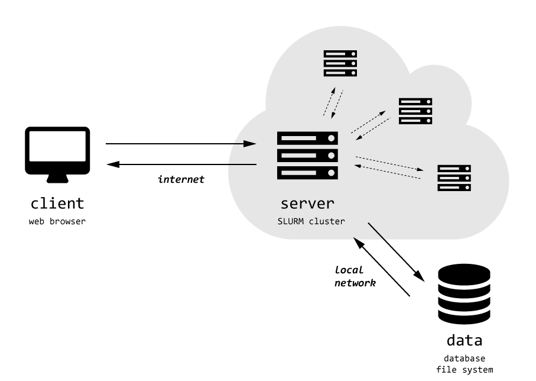

.. _introduction:

************
Introduction
************

`TissueMAPS` is a web-based, cluster-integrated tool for visualizing and analyzing large-scale microscopic image datasets.

Microscopy image datasets can easily amount to several terabytes, which makes it impractical to store and process them on a local computer. Instead, images  are often stored on a remote data volume and processed by cluster computing.

`TissueMAPS` runs on a virtual machine (*VM*) within a cloud, where it has access to a shared files system and a cluster computing infrastructure. Users interact with the program via the Internet.

The web-based approach has the advantage that large datasets can be handled efficiently and conveniently from a remote computer via a standard web browser.

On the server side, `TissueMAPS` uses Python as a glue language and the `tmlib` Python package serves as a library for tasks related to image storage and processing. The library has an object-orientated design and provides classes for file system operations and interaction with the computer cluster.

.. _file-system-configuration:

File system configuration
=========================

The organizational unit of `TissueMAPS` is an **Experiment**, which is represented by a directory on disk that holds the microscopic image files and related files for metadata, calculated statistics or extracted features.

.. _user-configuration-settings:

User configuration settings
---------------------------

The location of files on disk can be configure via an experiment-specific user configuration file in `YAML <http://yaml.org/>`_ format.

.. literalinclude:: ./../tmlib/user.cfg.template

By default, all files belonging to an experiment are stored within the root experiment folder. However, a user can overwrite these default locations.

.. _workflow:

Workflow
========

The data unit for visualization of images and the corresponding features is a **Layer**. `TissueMAPS` supports two types of layers and their generation requires different image processing steps:

**Channel** layers are comprised of the actual microscopic raster images. For interactive visualization via the web, images are converted into `zoomify <http://www.zoomify.com/>`_ format. These so called `pyramids <https://en.wikipedia.org/wiki/Pyramid_(image_processing)>`_ represent a large image by several smaller image tiles (stored in `JPEG <http://www.jpeg.org>`_ files) at different resolution levels. Only the tiles that are required for the current view are loaded and streamed to the client.

**Object** layers represent geometrical structures, such as cell segmentations or wells in a multi-well plate. They are rendered on the client side as vector graphics. The data that specifies the location of objects in the map as well as the corresponding features that describe properties of the objects are stored in `HDF5 <https://www.hdfgroup.org/HDF5/>`_ files. 

The generation of these layers from the microscopic images generally involves the following sequence of steps, which can be combined into an automated *workflow*:

.. _steps:

Steps
-----

Each step of the workflow corresponds to a subpackage of the `tmlib` package:

- `metaextract <../tmlib/metaextract>`_: **Extraction of metadata from microscope files**
    Microscopes usually store images together with additional acquisition information in vendor-specific formats. These are often not understood by standard readers. The `Bio-Formats <https://www.openmicroscopy.org/site/products/bio-formats>`_ Java library is used to extract the metadata from heterogeneous image file formats. These are stored as `OMEXML <https://www.openmicroscopy.org/site/support/ome-model/ome-xml/index.html>`_ files according to the standardized `OME <https://www.openmicroscopy.org/site/support/ome-model/>`_ data model.

- `metaconfig <../tmlib/metaconfig>`_: **Configuration and Complementation of metadata**
    The information that can be retrieved from individual image files is often not sufficient for automated processing in subsequent steps. In particular, information about the position of images within the scanned grid, which is required to stitch individual images together for the creation of an overview of the entire acquisition area, may not be available from image files, but rather needs to be provided by additional microscope-specific metadata files or user input. Metadata from these various resources is combined into a single *OMEXML* per image acquisition.

- `imextract <../tmlib/imextract>`_: **Extraction of images from files**
    Image files may contain more than one image. For example, images acquired at different *z*-resolutions are often stored in the same file. Some microscopes even store all images in a single file. 
    These formats are not practical, because they require specialized readers. In addition, it is desirable to apply image compression to save storage space. To these ends, each 2D plate is extracted from the original file and stored in a separate `PNG <http://www.libpng.org/pub/png/>`_ file. Optionally, images acquired at different *z*-resolutions (*z*-stacks) are projected to 2D. Note that mapping from source to target files is already created in the `metaconfig` step.

- `corilla <../tmlib/corilla>`_: **Calculation of illumination statistics**
    Microscopic images generally display illumination artifacts. Correction of these artifacts is important for visualization and even more so for quantitative analysis of pixel intensity values. Illumination statistics are pre-calculated across all acquisition sites and stored in `HDF5 <https://www.hdfgroup.org/HDF5/>`_ files. They can later be applied to individual images for correction.

- `align <../tmlib/align>`_: **Image registration and alignment**
    Images may be acquired at different time points with a potential shift in x-y directions between acquisitions. In order to be able to overlay images from different *cycles*, images have to be registered and aligned. Shift statistics are pre-calculated for each acquisition site and stored as `JSON <http://www.json.org/>`_ files.

- `jterator <../tmlib/jterator>`_: **Image segmentation and feature extraction**
    Biologically meaningful objects (e.g. "cells") are detected in the images by segmentation and features can be extracted for the detected objects.
    To this end, users can build custom image analysis *pipelines* by combining available modules in a `CellProfiler <http://cellprofiler.org/>`_ like web interface. The outlines of segmented objects and the extracted features are stored in `HDF5 <https://www.hdfgroup.org/HDF5/>`_ files.

- `illuminati <../tmlib/illuminati>`_: **Creation of image pyramids**
    Individual images are stitched together to one big overview image according the positional information provided by the obtained metadata. Images are also corrected for illumination artifacts and aligned if necessary based on the calculated illumination and shift statistics, respectively. Segmented objects get global IDs assigned and their locations within images are translated into global map coordinates. Channel images are stored in `JPEG <http://www.jpeg.org>`_.

Programmatically, each step is represented by `GC3Pie tasks <http://gc3pie.readthedocs.org/en/latest/programmers/api/gc3libs/workflow.html#gc3libs.workflow.SequentialTaskCollection>`_, which can combined into larger automated workflows. Individual steps are added to the workflow dynamically at runtime, but the steps can be configured in advance via the configuration settings file. To this end, the user needs to provide the required arguments for each step and can overwrite default settings for optional arguments.

.. _command-line-interface:

Command-line interface
----------------------

Each of the above listed packages contains the following modules, which provide an application programming interface (**API**) and a command-line interface (**CLI**):

- **argparser**: Serves an instance of class `argparse.ArgumentParser <https://docs.python.org/3/library/argparse.html#argumentparser-objects>`_ that processes command line arguments and parses them to the *cli* class. The parser has the same name as the package and each subparser has a corresponding method in the *cli* class.
- **cli**: The *cli* class gets initialized with the parsed arguments and the method with the name of the specified subparser gets called. The method in turn initializes an instance of the *api* class and delegates the actual processing to lower level methods of this class. Of particular importance for the workflow is the *init* method, which handles arguments for fine-tuning of the step and creates persistent job descriptions on disk.
- **api**: The *api* class provides methods for all *GC3Pie* related magic, such as creation and submission of jobs.

The *api* and *cli* classes inherit from the `CommandLineInterface` and `ClusterRoutines` base classes, respectively. This approach makes it easy to further extend the workflow by additional steps and allows a common syntax for command line calls:

.. code-block:: bash

    <class_name> <class_args> <method_name> <method_args>

where

* **class_name** is the name of the main parser corresponding to the *cli* class of an individual step
* **class_args** are arguments that are handled by the main parser, such as the logging verbosity level or the path to the directory of the experiment that should be processed, which are used to instantiate the corresponding *api* class
* **method_name** is the name of a subparser corresponding to a method of the *cli* class
* **method_args** are arguments that are handled by the subparser and are forwarded to the methods of the *api* class

The ``-h`` or ``--help`` argument can be used to get help for a particular step:

.. code-block:: bash
    
    <class_name> --help

It can also be used to get help for individual methods available for a particular step:

.. code-block:: bash

    <class_name> <class_args> <method_name> --help

By default, each step is equipped with the following methods:

* **init**: initialize a step and create persistent job descriptions
* **run**: run an individual job on the local machine
* **submit**: submit all jobs to the cluster and continuously monitor their status

Optionally, steps may provide additional methods, such as:

* **collect**: collect the job output of parallel runs and fuse the data spread across individual files into a single dataset if necessary
* **apply**: apply statistics calculated by the step to individual images

Here is an example call for the `metaconvert` step:

.. code-block:: bash
    
    metaconfig -v ./ init --format cellvoyager

would initialize the `metaconfig` step and create persistent job descriptions on disk, which could subsequently be used to *run* or *submit* jobs. It further specifies a custom file format and thereby adapts the behavior of the program. 

