**********
User guide
**********

`TissueMAPS` uses the `client-server model <https://en.wikipedia.org/wiki/Client%E2%80%93server_model>`_, where clients can make requests to the server via a `REST API <http://rest.elkstein.org/2008/02/what-is-rest.html>`_ using the `Hyperstate Transfer Protocol (HTTP) <https://en.wikipedia.org/wiki/Hypertext_Transfer_Protocol>`_.

Most users will interact with the server via the browser-based interface. However, additional `HTTP` client implementations are provided via the :mod:`tmclient` package, which allows users to interact more programmatically with the server. These use cases are covered in the section `interacting with the server <interacting-with-the-server>`_.

The server handles client requests, but delegates the actual processing to the :mod:`tmlibrary` package. The *TissueMAPS* library provides active programming (*API*) and command line interfaces (*CLI*), which can also be used directly, i.e. in a server-independent way. This is covered in the section `using the library <using-the-library>`_.

.. _interacting-with-the-server:

Interacting with the server
===========================

This section demonstrates different ways of interacting with a *TissueMAPS* server. All of them of course require access to a running server instance. This may either be a production server that you access via the internet or a development server running on your local machine. The following examples are given for ``localhost``, but they similarly apply a server running on a remote host.

.. tip:: Here, we connect to the server using *URL* ``http://localhost:8002``. The actual IP address of ``localhost`` is ``127.0.0.1`` (by convention). It's possible to use the name ``localhost``, because this host is specified in ``/etc/hosts``. So when you are running the *TissueMAPS* server on a remote host in the cloud instead of your local machine, you can use the same trick and assign a hostname to the public IP address of that virtual machine. To this end, add a line to ``/etc/hosts``, e.g. ``130.211.160.207   tmaps``. You will then be able to connect to the server via ``http://tmaps``. This can be convenient, because you don't have to remember the exact IP address (which may also be subject to change in case you don't use a static IP address). Note that you don't need to provide the port for the production server, because it will listen to port 80 by default (unlike the development server, who listens to port 8002).

.. _user-interface:

User interface
--------------

Enter the IP address (and optionally the port number) of the server in your browser. This directs you to the *index* site and you are asked for your login credentials.

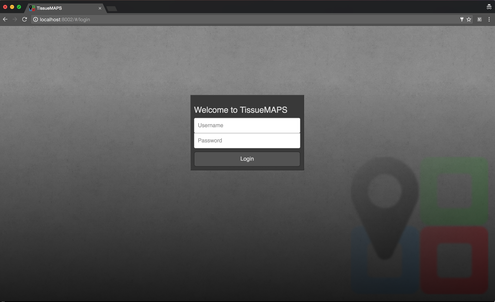

   Login prompt.

   Enter username and password into the provided forms.

.. _user-interface-user-panel:

User panel
^^^^^^^^^^

After successful authorization, you will see an overview of your existing experiments.

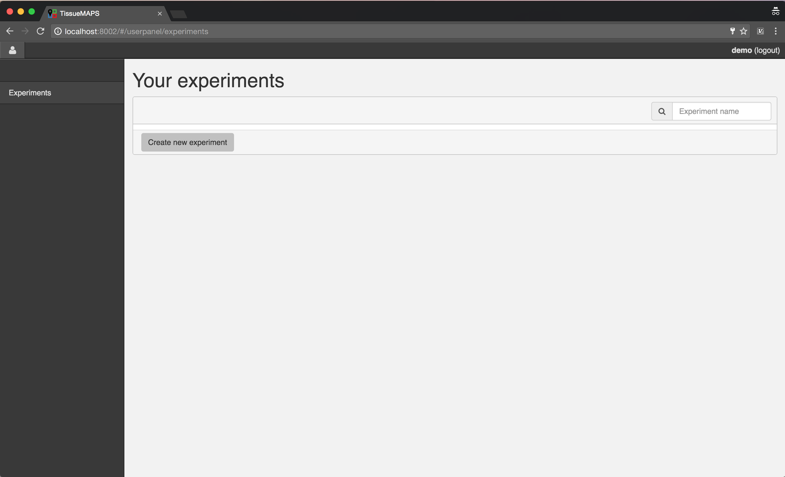

   Experiment overview.

   Empty list because no experiments have been created so far.

.. _user-interface-creating-experiment:

Creating an experiment
++++++++++++++++++++++

To create a new :class:`experiment <tmlib.models.experiment.Experiment>`, click on |create_new_exp_button|.

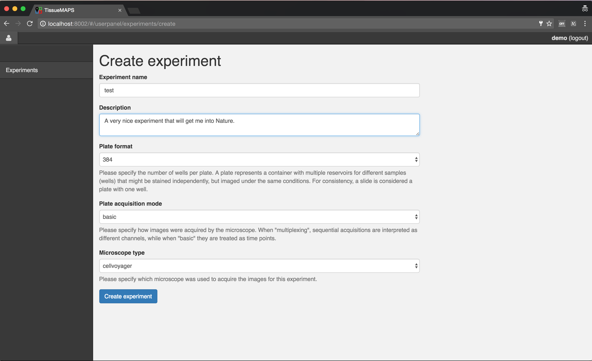

   Experiment creation.

   Provide information about the image acquisition process of the experiment.

When you click on |create_exp_button|, the experiment gets created and you get directed back to the overview.

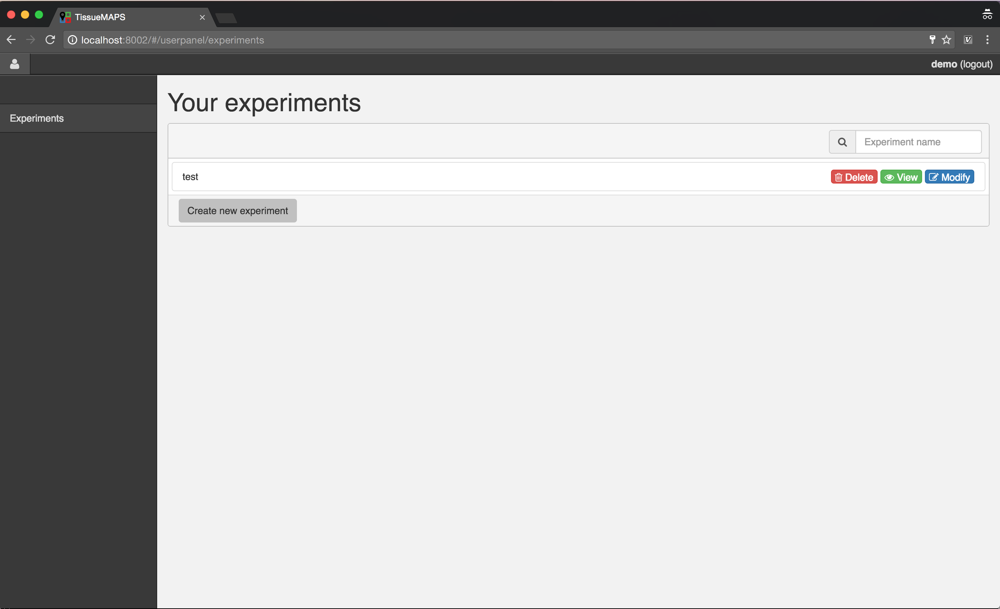

   Experiment overview.

   The created experiment is listed.

.. note:: By default, experiments can only be viewed and modified by the user who created them, but they can be shared with other users. However, this functionality is currently only available via the API (see :class:`ExperimentShare <tmlib.models.user.ExperimentShare>`).

Next, you can upload images and process them. To this end, click on |modify_button|, which directs you to the workflow manager.

.. _user-interface-workflow-manager:

Workflow manager
^^^^^^^^^^^^^^^^

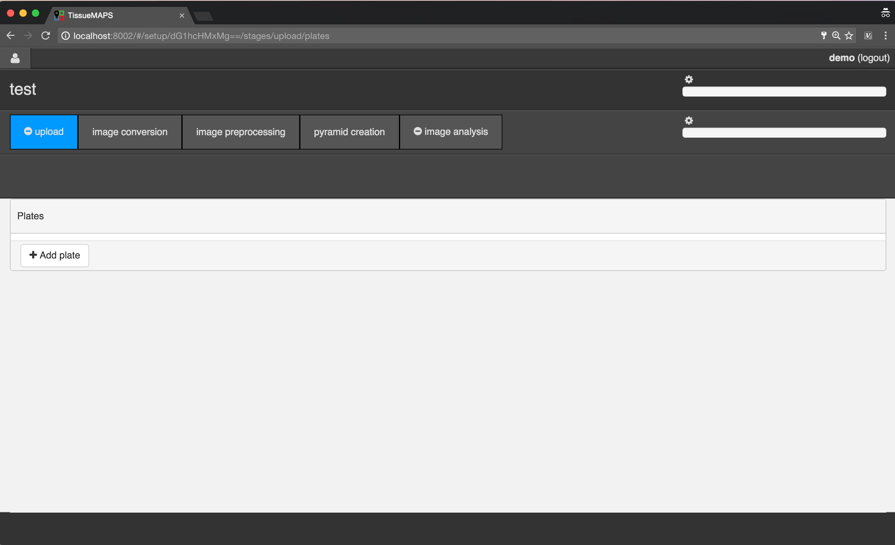

   Workflow manager.

   Interface for uploading and processing images. At the top of the page there is a button for *upload* and one for each stage of the :ref:`canonical workflow <canonical-workflow>`.

.. _user-interface-workflow-manager-uploading-images:

Uploading image files
+++++++++++++++++++++

To begin with, add a new :class:`plate <tmlib.models.plate.Plate>`, by clicking on |create_plate_button|.

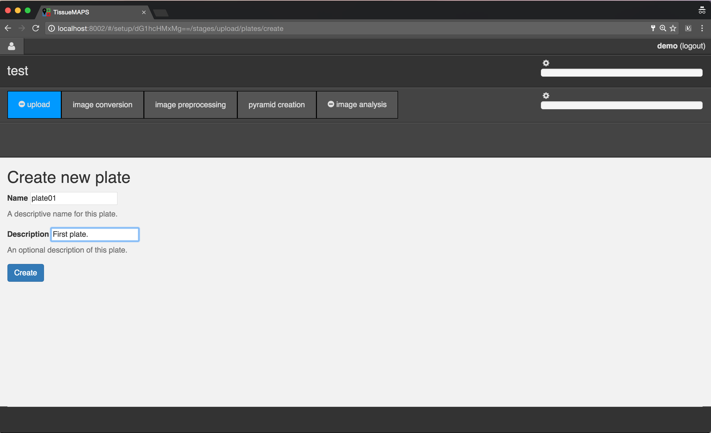

   Plate creation.

   Provide a name and optionally a description for the plate.

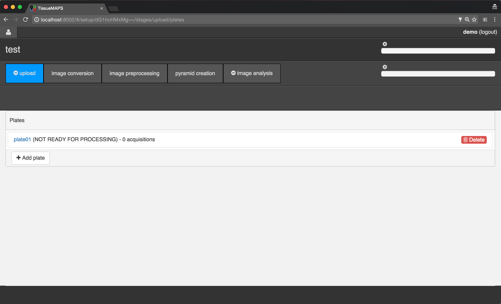

   Plate overview.

   The created plate is now listed. It is not yet ready for processing, because it doesn't contain any acquisitions yet.

Select the created plate, by clicking on the link |plate_link|.

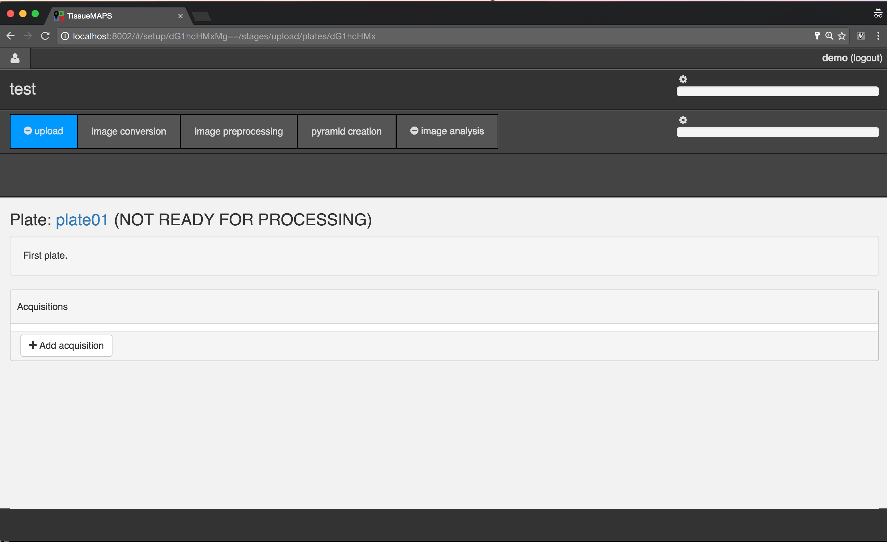

   Acquisition overview.

   Empty list because no acquisitions have been added so far for the selected plate.

Add a new :class:`acquisition <tmlib.models.acquisition.Acquisition>`, by clicking on |create_acq_button|.

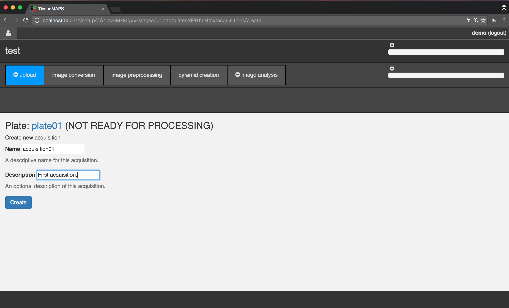

   Acquisition creation.

   Provide a name and optionally a description for the acquistion.

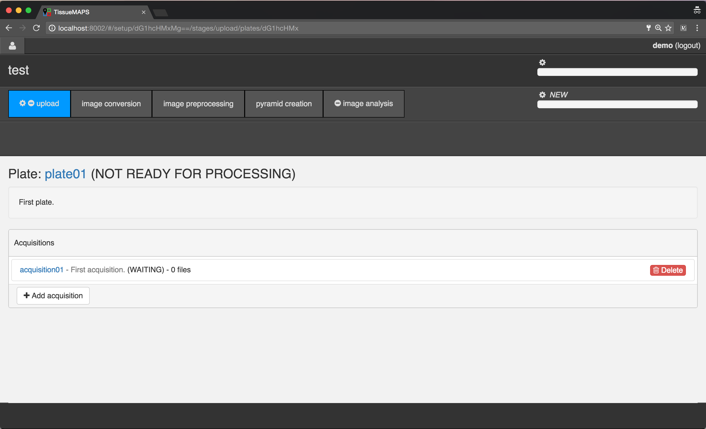

   Acquisition overview.

   The created acquisition is now listed. It has status "WAITING" because no images have yet been uploaded.

Select the created acquisition, by clicking on the link |acq_link|.

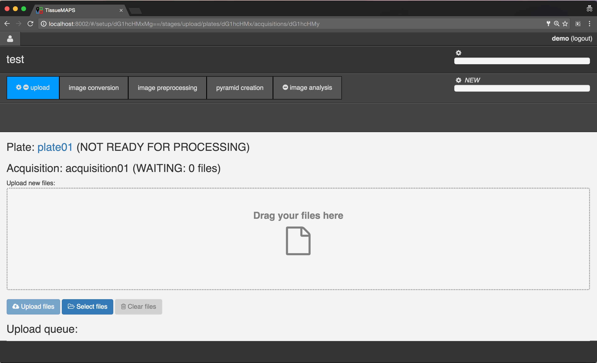

   Upload.

   Either drag and drop files or folders into the dedicated area or select them from your local filesystem by clicking on |select_files_button|. Then click on |upload_files_button| to start the upload process.

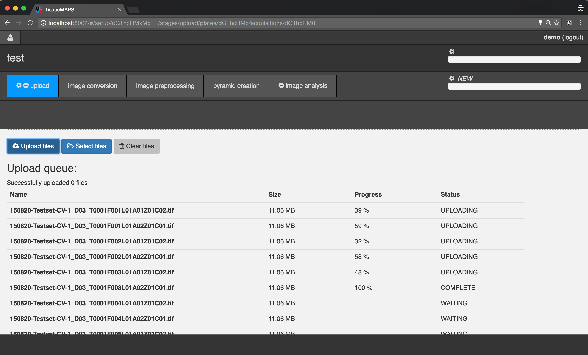

   Upload in process.

   You can monitor the upload status of individual files.

.. note:: File upload via the user interface works reliable for serveral thousand images. When uploading tens or hundreds of thousands of images, we recomment uploading files via the command line instead. To this end, you can use the ``tm_upload`` tool provided by the :mod:`tmclient` package.

.. note:: The upload process will be interrupted when the page gets reloaded. However, you can simply add the files afterwards again and restart uploading. The server keeps track which files have already been uploaded and won't upload them again.

   Plate overview.

   The loading bar in the top right corner indicates that the upload was successful and is "TERMINATED". The plate is now ready for processing.

You can add additional acquisitions and plates to the experiments by repeating the steps described above. Once you have uploaded all files, you can continue to process them.

.. _user-interface-workflow-manager-processing-images:

Processing images
+++++++++++++++++

Once you have uploaded all files, you can proceed to the subsequent processing stages.

.. note:: You are prevented from proceeding until upload is completed. Requesting this information from the server may take a few seconds for large experiments.

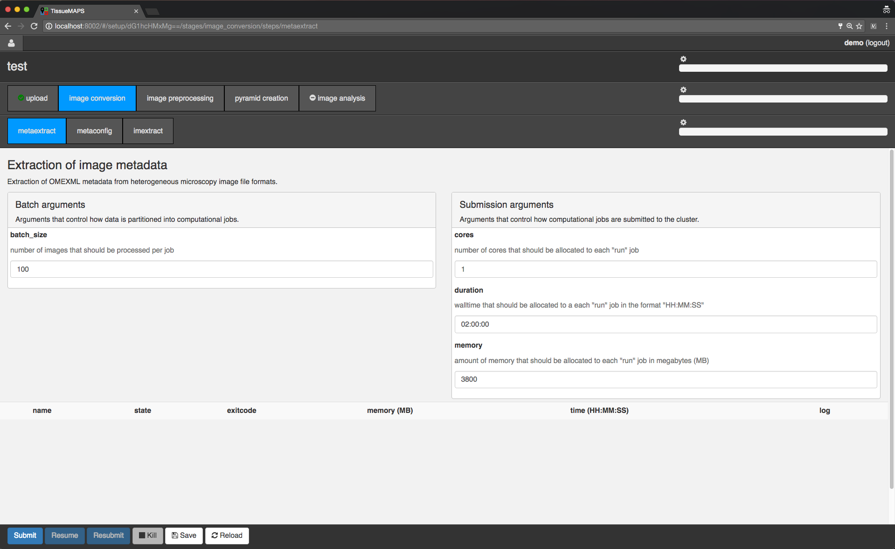

   Workflow control panel.

   You can toggle between different stages and steps. The view applies to the currently active combination of stage and step - in this case "image convesion" and "metaextract", respectively.

   The loading bars indicate the progress of workflow, stage and step. They are green by default, but turn red as soon as a single job failed. Above the loading bars, you can see the current processing state (e.g. "SUBMITTED", "RUNNING", or "TERMINATED"). When the currently active stage or step is in state "RUNNING", the cog wheel above the loading bar will also start spinning. The cog will also appear on the stage and step tabs to indicate the state of stages or steps, which are not selected at the moment.

   In the main window you can set "batch" and "submission" arguments to control the partition of the computational task into individual jobs and the allocation of resources for each job, respectively. Upon submission, individual jobs will be listed below the argument section. If required arguments are missing for a stage or step, this will be indicated on the corresponding tab by a minus (visible for the "image analysis" stage). In this case, you cannot submit these stages without providing the missing arguments.

   Since the workflow hasn't been submitted yet, the loading bars are all set to zero and no jobs are listed.

You can click through all stages and steps and set arguments according to your needs. Once you are happy with your settings, you can either |save_button| the settings or |submit_button| the workflow for processing (settings get also automatically saved upon submission).

.. note:: Submission depends on the current view. Only the currently active stage as well as stages to the left will be processed. For example, if you are in stage "image preprocessing" and you click on |submit_button|, only stages "image conversion", "image preprocessing" and "pyramid creation" will be submitted.

.. note:: Arguments ``batch_size`` and ``duration`` depend on each other. The larger the batch, i.e. the more images are processed per compute unit, the longer the job will typically take.

.. note:: Arguements ``cores`` and ``memory`` depend upon the available compute resources, i.e. the number of CPU cores and the amount of RAM available per core. The defauls of 3800MB applies to the default machine type flavor at ScienceCloud at University of Zurich and may need to be adapted for other clouds.

For now, let's submit the workflow from the first stage "image conversion".

.. figure:: ./_static/ui_workflow_stage_one_submitted.png
   :width: 75%
   :align: center

   Workflow submission in progress.

   After submitting the workflow from stage "image conversion", the state of step "metaconfig" switched to "RUNNING" and individual jobs are listed. Some of the jobs are already "TERMINATED", while some are still "RUNNING". Note the cogs on the tabs of the other steps indicating that they have also been submitted for processing.

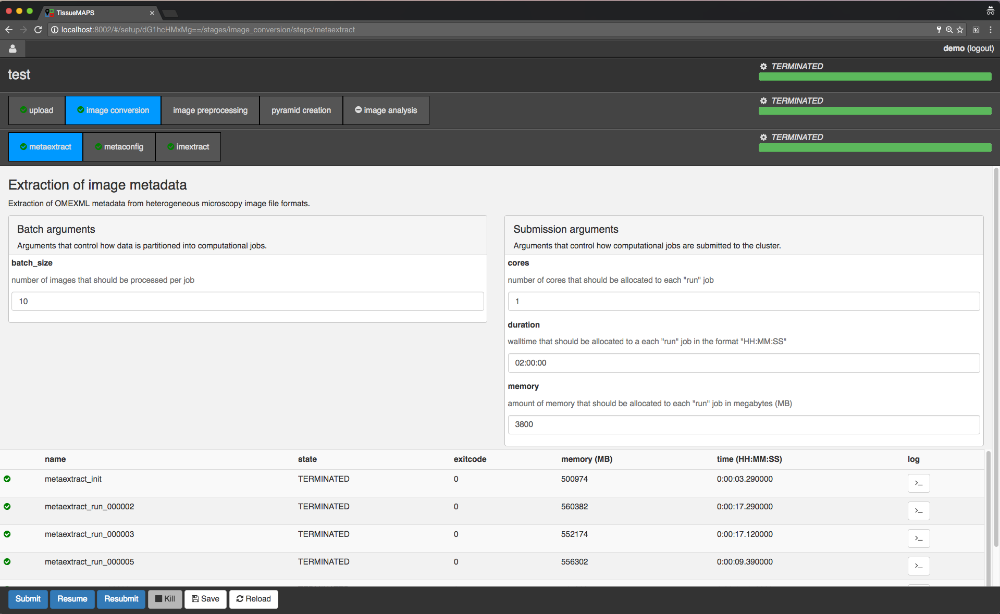

   Workflow submission done.

   All steps of stage "image conversion" have been processed and all jobs have "TERMINATED" sucessfully, noticeable by the fully loaded green bars as well as the green checks on stage/step tabs and individual job items.

.. note:: Once a workflow has been submitted, you can safely close the window or disconnect from the internet, since the jobs are processed remotely on the server in an asynchronous manner.

Once stage "image conversion" is done, you can proceed to any other stage and click on |resume_button|. Alternatively, you could have submitted a further downstream stage in the first place.

For the purpose of this demo, we will proceed to stage "pyramid creation" and resume the workflow.

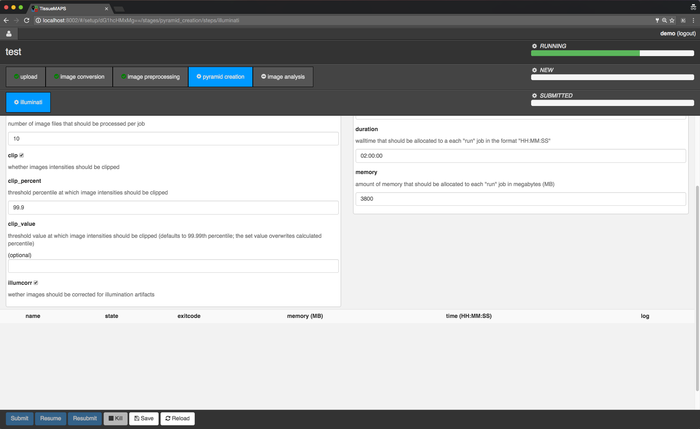

   Workflow submission resumed.

   After successful termination of stage "image conversion", the workflow has been resumed from stage "pyramid creation", which is currently in state "NEW".

.. note:: Once stage "pyramid creation" is done, you can already view the experiment. However, you won't be able to visualize segmented objects on the map. To this end, you first need to process stage "image analysis".

You can further |resubmit_button| the workflow with modified arguments from any stage afterwards.

The image analysis stage is a bit more complex, therefore we will cover it in a separte section.

.. _workflow-interface-image-analysis-pipeline:

Setting up image analysis pipelines
+++++++++++++++++++++++++++++++++++

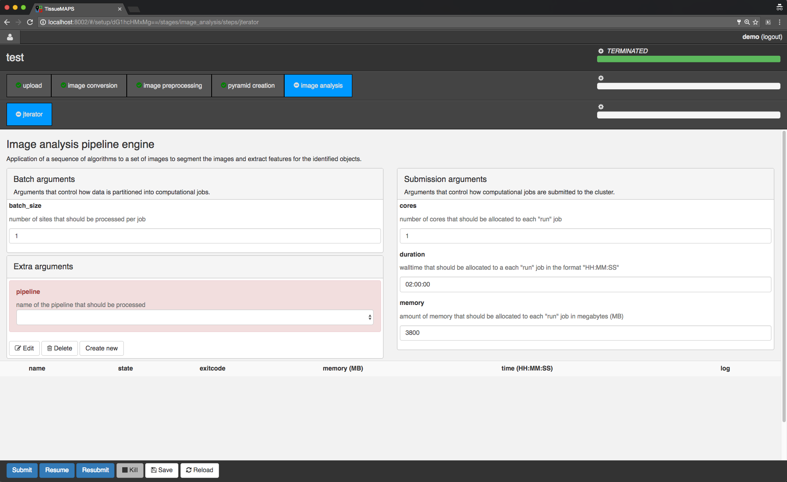

   Image analysis stage.

   Notice the "extra arguments" section, which hasn't been present in any of the other previous stages. You are required to select a "pipeline", which should be processed by the "jterator" step. Since no pipeline has been created so far, the drop-down menue is empty.

To begin with, you need to create a pipeline. To this end, click on |create_pipe_button|. Give the pipeline a descriptive name, here we call it ``test-pipe``.
This will direct you to a separte interface for defining the pipeline.

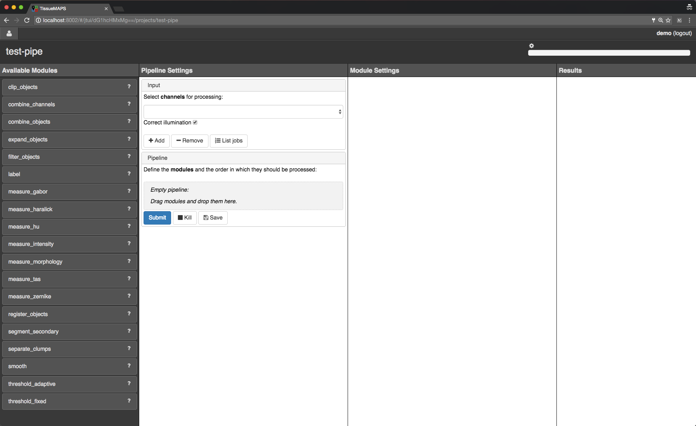

   Jterator interface.

   On the left side in the "Available Modules" column, you find all modules implemented in the :mod:`jtmodules` package. "Pipeline Settings" describes the input for the pipeline in form of "channels" and lists modules that have been added to the pipeline. The module "Module Settings" section describes input arguments and expected outputs of the currently selected module.

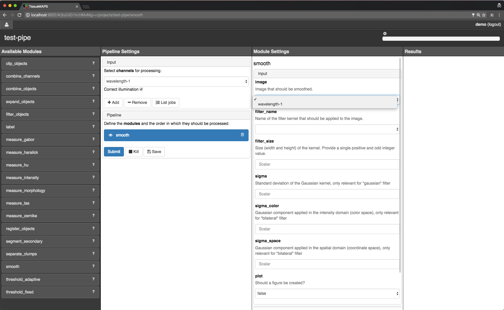

   Pipeline and module settings.

   You can drag and drop modules from the list of available modules into the indicated field in the *pipeline* section and then click on added item to set module parameters. The order of modules in the pipeline can be rearranged by dragging them up or down.

   You can further select *channels* in the *input* section to make them available to the pipeline. Additional *channels* can be removed when neeeded. The selected "channels" become available as an *input* for the selected module.

.. tip:: Images for all *channels* selected in the *input* section will be loaded into memory (for the acquisition site corresponding to the given batch). So remove any channel you don't use in your pipeline to gain performance.

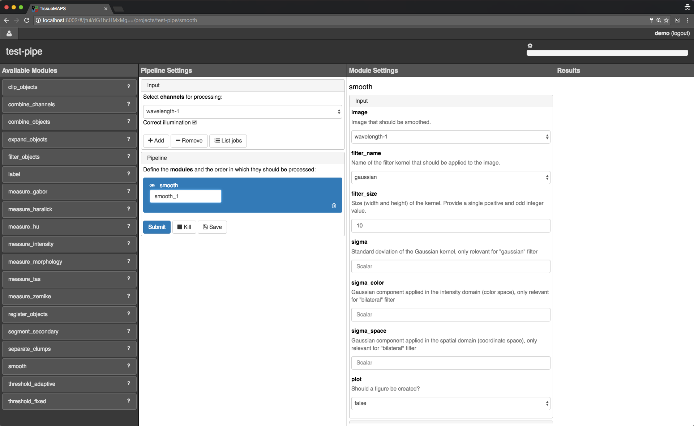

   Module renaming.

   A module can be renamed by clicking on the textfield in the respective pipeline item. Enter a new name in the provided field and press enter. Note, that the name in the "Module Settings" column remains unchanged. It continues to refer to the module source file.

.. note:: Names of modules in the pipeline must be unique. When adding the same module twice, it will be automatically renamed by appending it with a number. Be aware that names of module outputs must be hashable and therefore also unique. Best practice is to use to use the module as a namespace: ``<module_name>.<output_argument_name>``, e.g. ``smooth.smoothed_image`` for the above example. Since module names must be unique the resulting *output* will consequently have a unique name, too.

Add all modules to the pipeline that you need for your analysis and set parameters.

.. note:: Types of *input* parameters are checked internally. Only inputs matching the type definition of the *input* argument are listed in the drop-down menue.

Here, we will first add all the modules required to segment "Nuclei" and "Cells" in the images.

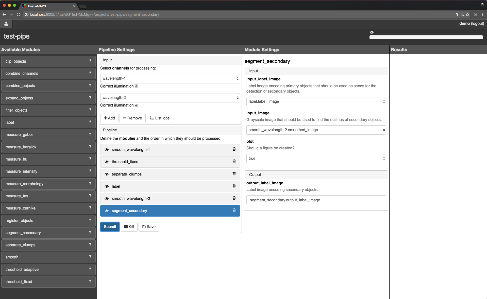

   Example segmentation pipeline.

   This pipeline identifies primary ("Nuclei") and secondary objects ("Cells"): The image corresponding to channel "wavelength-1" is smoothed and subsequently thresholded. The resulting mask is then labeled to define individual primary objects. The primary objects are subsequently expanded using a watershed transform of the smoothed image belonging to channel "wavelength-2", which generates secondary objects.

The pipeline can be saved at any time by clicking on |save_button|. This will save the pipeline settings as well as settings of each module in the pipeline.

When all required parameters are set, the pipeline can be submitted by clicking on |submit_button| (submission will automatically save the pipeline as well).

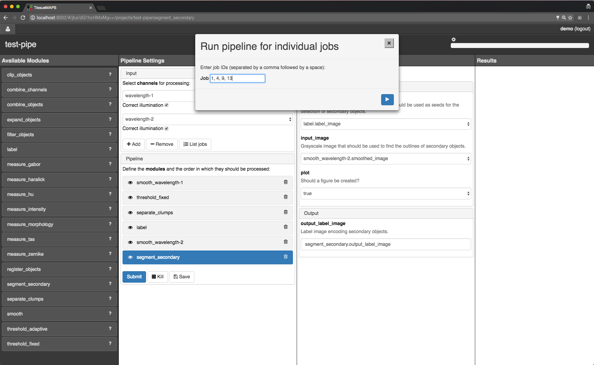

   Pipeline submission.

   Up to ten jobs can be maximally submitted for a pipeline.

To see which acquisition sites the jobs map to, click on |list_jobs_button|.

.. figure:: ./_static/ui_jterator_joblist.png
   :width: 75%
   :align: center

   Job list.

   The table shows the name of "plate" and "well" as well as the "x" and "y" coordinate of each :class:`site <tmlib.models.site.Site>` corresponding to a particular job. This is intended to help you select job IDs for testing your pipeline, such that you include images from different wells or positions within a well.

.. note:: In the workflow panel you can set a ``batch_size`` for the "jterator" step. However, when you submit the pipeline for testing in the jterator user interface, ``batch_size`` will be automatically set to 1, such that only one acquisition :class:`site <tmlib.models.site.Site>` will be processed per job.

Once submitted, jobs get cued and processed depending on available computational resources. If you have access to enough compute units, all jobs will be processed in parallel.

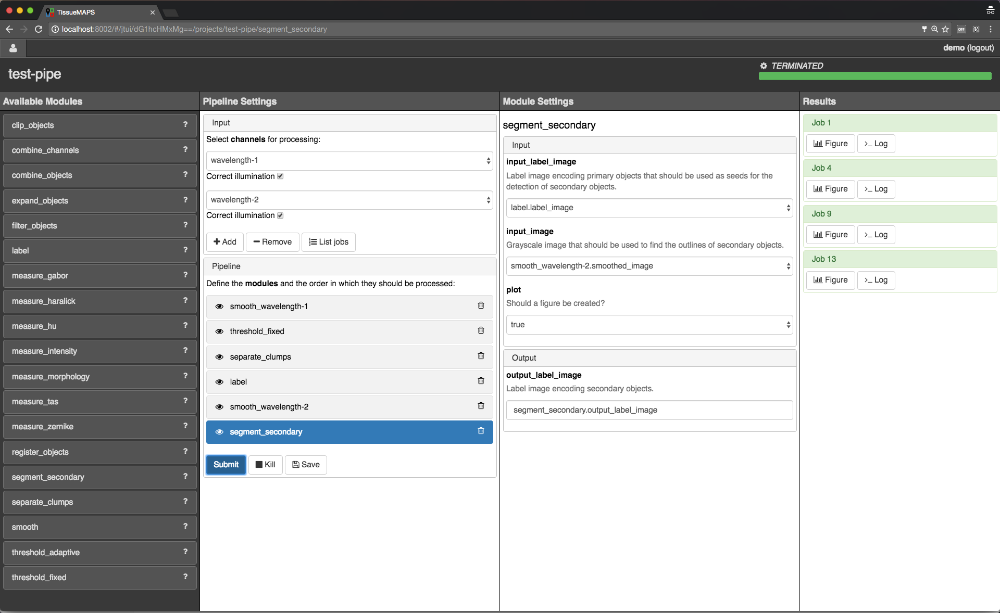

   Pipeline results.

   Results of individual jobs are listed in the "Results" column. |figure_button| is active for the currently selected module.

When clicking on |figure_button|, the figure for the respective job is displayed in fullscreen mode.

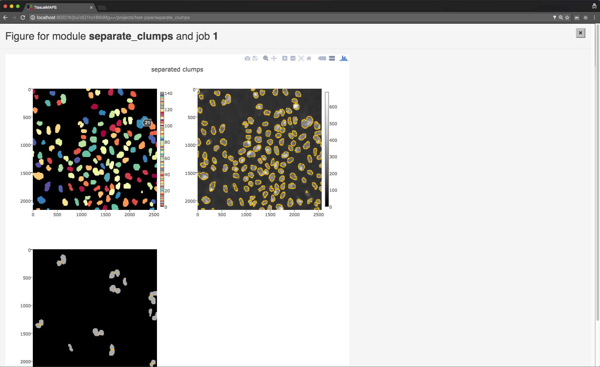

   Module figures.

   Figures are interactive. Pixels values are displayed when hovering over images. You can also zoom into plots to have a closer look. Be aware, however, that plots may have a reduced resolution.

.. note:: Plotting needs to be explicitely activated for a module by selecting ``true`` for argument "plot". This is done to speed up processing of the pipeline.

When clicking on |log_button|, the log output for the respective job is displayed. The messages includes the log of the entire pipeline and is the same irrespective of which module is currently active.

.. figure:: ./_static/ui_jterator_log.png
   :width: 75%
   :align: center

   Pipeline log outputs.

   Standard output and error are caputered for each pipeline run. The logging level is set to ``INFO`` by default.

To save segmented objects and be able to assign values of extracted features to them, objects need to be registered using the :mod:`register_objects <jtmodules.register_objects>` modules. From a user perspective, the registration simply assigns a name to a label image.

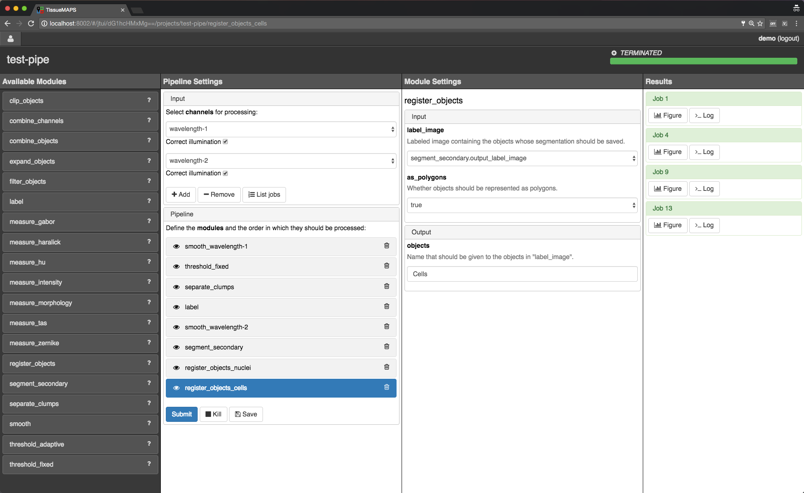

   Object registration.

   Assign a unique, but short and descriptive name to each type of segmented objects that you want to save. To this end, objects need to be provided in form of a labled image, where each object has a unique ID, as output by the :mod:`label <jtmodules.label>` module, for example.

When we are happy with the segmentation results, we can add addtional modules for feature extraction.

.. warning:: All extracted features will be automatically saved. Since the resulting I/O will increase processing time, its recommended to exclude *measurement* modules from the pipeline for tuning segmentation parameters.

.. tip:: You can inactivate modules by clicking on |eye_open_symbol| without having to remove them from the pipeline. Just be aware that this may affect downstream modules, since the *output* of inactivated modules will of course no longer be produced.

.. tip:: You can quickly move down and up in the pipeline in a `Vim <http://www.vim.org/>`_-like manner using the *j* and *k* keys, respectively.

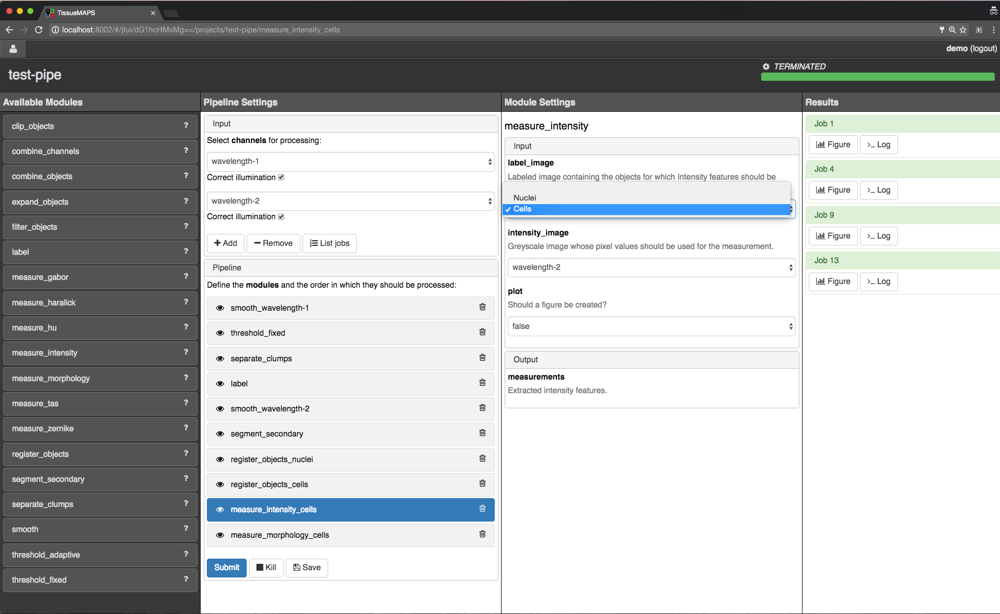

   Feature extraction.

   Select a previously registerd object type for which you would like to take a measurement. Some features, such as ``intensity`` require an additional raster image. Others, such as ``morphology`` measure only object size and shape and are thus independent of the actual pixel intensity values.

.. note:: Feature names follow a convention: ``<class>_<statistic>_<channel>``. In case features are intensity-independent, the name reduces to ``<class>_<statistic>``. For the above example this would result in ``Intensity_mean_wavelength-2`` or ``Morphology_area``.

Once you have set up your pipeline, save your pipeline (!) and return to the workflow panel. Select the created pipeline and submit the "image analysis" stage by clicking on |resume_button|. In contrast to submissions in the *jterator* user interface, this will now submit all jobs and potentially run more than one pipeline per job in a sequential manner, depending on the specified ``batch_size``.

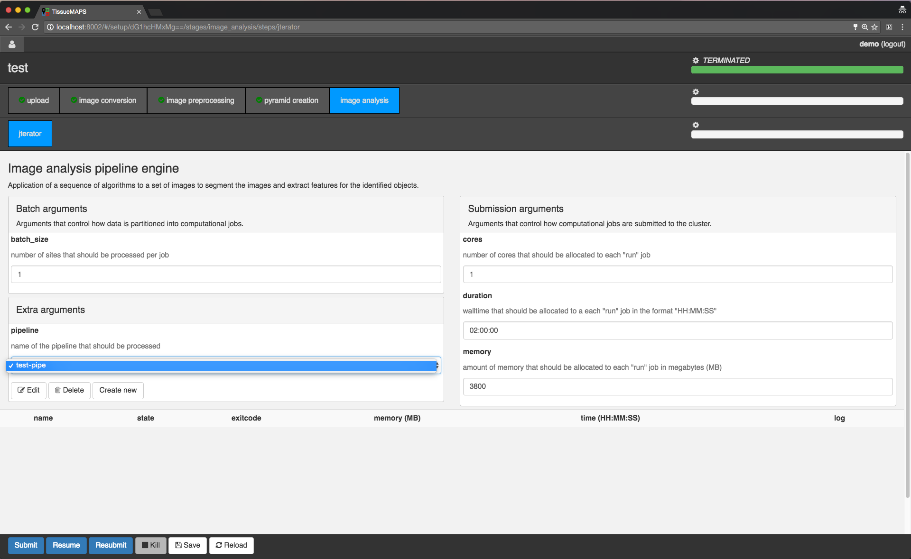

   Image analysis submission.

   Select the created pipline in the drop-down menu. In case the pipeline doesn't show up, you may have to |reload_button| the workflow settings.

.. _user-interface-viewer:

Viewer
^^^^^^

Once you've setup your *experiment*, you can view it by returning to the `user panel`_ and clicking on |view_button|.

.. _user-interface-viewer-map:

The MAP
+++++++

The interactive *MAP* is the centerpiece of *TissueMAPS* (as the name implies).

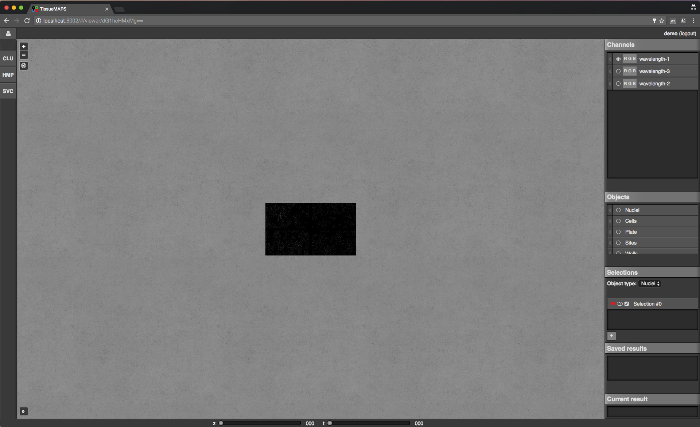

   Viewer overview.

   Upon initial access, the first channel is shown in the viewport at the maximally zoomed-out resultion level.
   You can zoom in and out using either the mouse wheel or trackpad or the + and - buttons provided at the top left corner of the viewport.
   The map can also be repositions within the viewport by dragging it with the mouse.

   To the right of the viewport is the map sidebar and to the left the tool sidebar. Sections of the map control sidebar can be resized using the mouse and individual items can be rearranged via drag and drop.
   Below the viewport are sliders to zoom along the *z*-axis or time series for experiment comprised of images acquired at different *z* resolutions or time points, respectively.

The map sidebar has the following sections:

    - ``Channels``: one raster image layer for each channel (created during the "pyramid_creation" workflow stage)
    - ``Objects``: one vector layer for each object type (created during the "image_analysis" workflow stage)
    - ``Selections``: tool for selecting mapobjects on the map
    - ``Saved results``: one vector layer for each saved (previously generated) tool result
    - ``Current result``: single vector layer for the most recent tool result

Individual sections are described in more detail below.

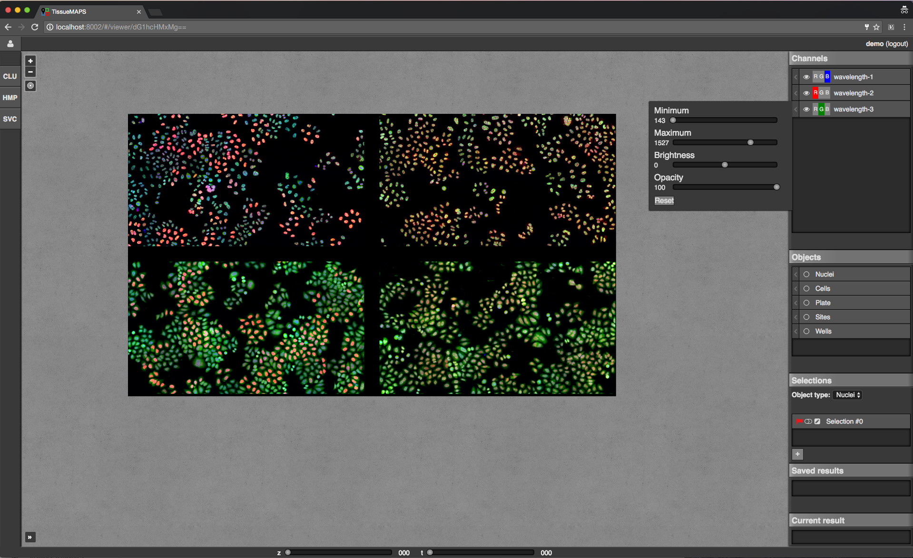

   Map sidebar: Channels.

   Channels are represented on the map in form of raster images. Individual channel layers can be toggled as well as dynamically colorized and rescaled.
   By default, channels are shown in grayscale. When multiple channels are active, colors are additively blended (e.g. red + green = yellow).
   Pixel intensities are mapped to 8-bit for map representation. However, intensities value shown below sliders reflect the original bit range.

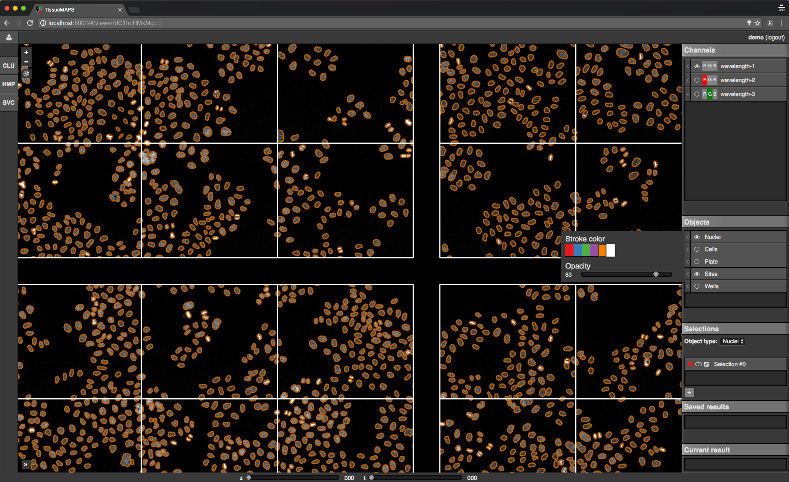

   Map sidebar: Objects.

   Objects are represented on the map in form of vector graphics. Individual object layers can be toggled as well as dyncamically colorized. In addition, the opacity of object outlines can be adapted. When multiple objects are active, colors are additively blended.

.. note:: Objects of type "Plates", "Wells" and "Sites" will be auto-generated based on available image metadata. These *static* types are independent of parameters set in the "image_analysis" workflow stage.

.. warning:: Object outlines may not be represented 100% accurately on the map, because the polygon contours might have been simplified server side.

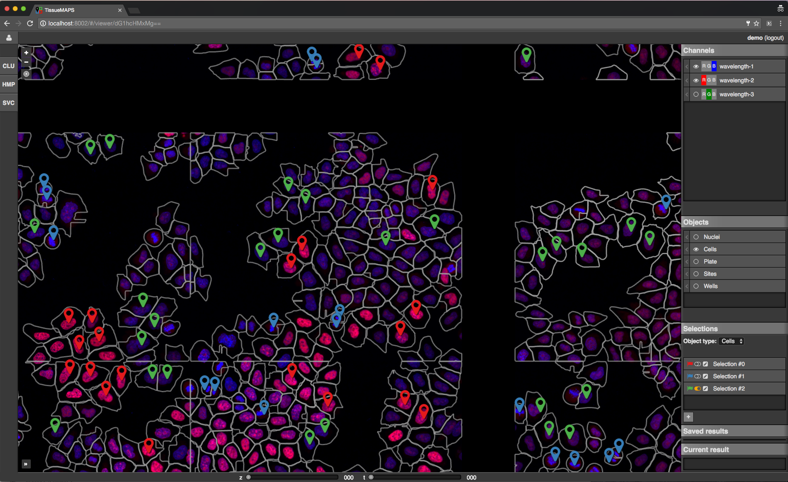

   Map sidebar: Selections.

   Objects can be selected and assigned to different groups. A map marker will be dropped at for selected object. An object can be unselected by clicking on it again using the same selection item. It is further possible to assign an object to more than one selection.
   The respective object layer will automatically be activated for the choosen mapobject type.

.. _user-interface-viewer-tools:

Data analysis tools
+++++++++++++++++++

*TissueMAPS* provides a plugin framework for interactive data analysis tools. Available tools are listed in the tool sidebar to the left of the viewport.

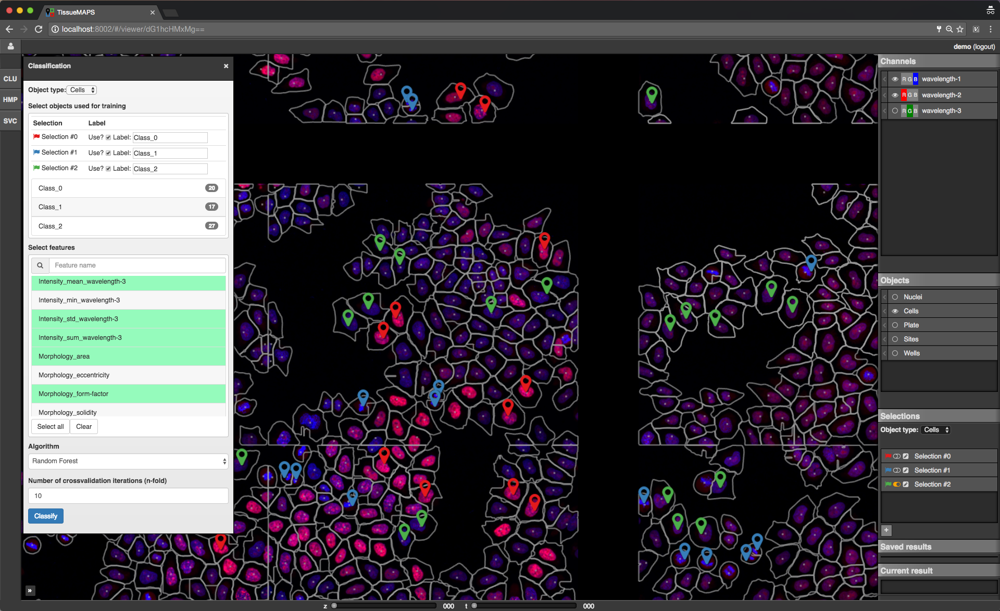

   Tool sidebar.

   Each tool is associated with a separate window, which opens when the corresponding tool icon is clicked in the tool sidebar.

   The window content varies between tools depending on their functionality. Typically, there is a section for selection of object types and features and a button to submit the tool request to the server.
   In case of the supervised classification (SVC) tool, there is also a section for assigning selections to label classes, which can be used for training of the classifier.

Let's say you want to perform a supervised classification using the "SVC" tool based on labels provided in form of map selections (see above).
To perform the classification, select an object type (e.g. ``Cells``) and one or more features from and click on |classify_button|. This will submit a request to the server to perform the computation. Once the classification is done the result will appear in the "Current result" section of the map control sidebar.

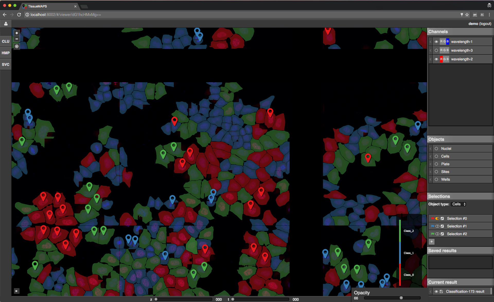

   Map sidebar: Current result.

   Once a tool result is available a layer will appear in the "Current result" section. Similar to object layers, they are represented on the map as vector graphics. In contrast to the object layers, however, the filled objects are shown instead outlines. Result layers can also be toggled and the opacity can be changed to reveal underlying channel layers (or other tool result layers).

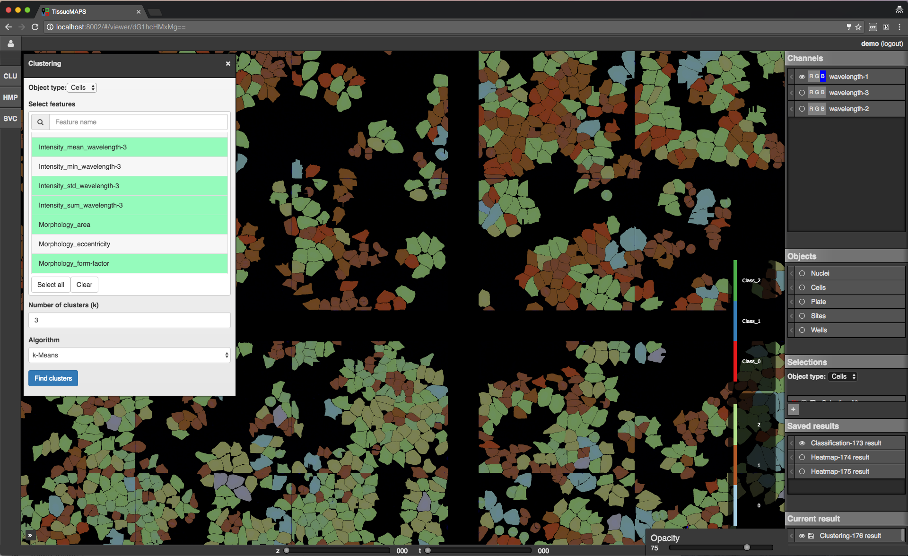

   Map sidebar: Saved results.

   When additional tool requests become available, the "Current result" moves to "Saved results" and gets replaced with the more recent result. Multiple results can be active simultaneously and their colors are additively blended. Transparency of result layers can be controlled independently. Here, we performed an additional unsupervised classification, using the same features and number of classes as in the supervised case, and can now visually compare the results of both analysis on the map.

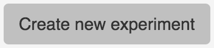

.. |create_exp_button| image:: ./_static/ui_create_exp_button.png
   :height: 15px

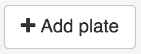

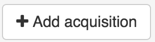

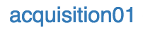

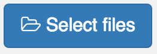

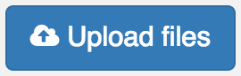

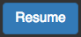

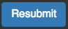

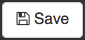

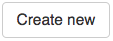

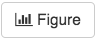

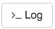

.. _restful-programming:

RESTful programming
-------------------

Clients use the :mod:`REST API <tmserver.api>` to access server side resources. In case of the user interface this is handled by the browser, but the same can be achieved in more programmatic, browser-independent way.

A request is composed of a resource specification provided in form of a `Uniform Resource Locator (*URL*) <https://en.wikipedia.org/wiki/Uniform_Resource_Locator>`_ and one of the following verbs: ``GET``, ``PUT``, ``POST`` or ``DELETE``.
The server listens to *routes* that catch request messages, handles them and returns a defined response message to the client. This response includes a `status code <https://en.wikipedia.org/wiki/List_of_HTTP_status_codes>`_ (e.g. ``200``) and the actual content. In addition, requests and responses have `headers <https://en.wikipedia.org/wiki/List_of_HTTP_header_fields>`_ that hold information about their content, such as the `media type <https://en.wikipedia.org/wiki/Media_type>`_ (e.g. ``application/json`` or ``image/png``).

Consider the following example:
Let's say you want to *GET* a list of your experiments. To this end, you can send the following request to the *TissueMAPS* server:

.. code-block:: http

    GET /api/experiments

The server would handle this response via the :func:`get_experiments() <tmserver.api.experiment.get_experiments>` view function and respond with this message (using the example given in the `user interface`_ section):

.. code-block:: http

    HTTP/1.1 200 OK
    Content-Type: application/json

    {
        "data": [
            {
                "id": "MQ==",
                "name": "test",
                "description": "A very nice experiment that will get me into Nature",
                "user": "demo"
            }
        ]
    }

The response has status code ``200``, meaning there were no errors, and the content of type ``application/json`` with the list of existing experiments. In this case, there is only one experiment named ``test`` that belongs to the ``demo`` user.

The same logic also applies to more complex `query strings <https://en.wikipedia.org/wiki/Query_string>`_ with additional parameters.

To download an image for a specific channel you could send a request like this:

.. code-block:: http

    GET /experiments/MQ==/channels/dG1hcHM0/image-file?plate_name=plate01,cycle_index=0,well_name=D03,x=0,y=0,tpoint=0,zplane=0

The server would respond with a message that contains the requested image as *PNG*-compressed binary data, which can be written to a file client-side using the provided filename:

.. code-block:: http

    HTTP/1.1 200 OK
    Content-Type: image/png
    Content-Disposition: attachment; filename="test_D03_x000_y000_z000_t000_wavelength-1.png"

    ...

Similarly, you can download all feature values extracted for a particular type of objects:

.. code-block:: http

    GET /api/experiments/MQ==/mapobjects/dG1hcHMx/feature-values

In this case, the server would respond with a message containing the requested feature values as *CSV*-encoded binary data, which can be written to a file using the provided filename:

.. code-block:: http

    HTTP/1.1 200 OK
    Content-Type: application/octet-stream
    Content-Disposition: attachment; filename="test_Cells_feature-values.csv"

    ...

For more information about available resources and verbs, please refer to :mod:`tmserver.api`.

.. _restful-programming-implementation:

Implementation
^^^^^^^^^^^^^^

In principle, ``GET`` requests could be handled via the browser. You can try it by entering a *URL* into the browser address bar, e.g.::

    http://localhost:8002/api/experiments

The server will responds with an error message with status code ``401`` (not authorized) because no access token was provided along with the request, which is required for `JWT authentication <https://jwt.io/introduction/>`_.

So to make requests in practice, we need a client interface that is able to handle authentication. This can be achieved via the command line using `cURL <https://curl.haxx.se/>`_ or through any other *HTTP* interface. In the following, we will demonstrate how requests can be handled in Python and Matlab:

.. _restful-programming-implementation-python-example:

Python example
++++++++++++++

.. code-block:: python

    import os
    import requests
    import json
    import cv2
    from StringIO import StringIO
    import pandas as pd

    def authenticate(url, username, password):
        response = requests.post(
            url + '/auth',
            data=json.dumps({'username': username, 'password': password}),
            headers={'content-type': 'application/json'}
        )
        response.raise_for_status()
        data = response.json()
        return data['access_token']

    def http_get(url, api_uri, token, **params):
        response = requests.get(
            url + '/' + api_uri, params=params,
            headers={'Authorization': 'JWT ' + token}
        )
        response.raise_for_status()
        return response

    def get_data(url, api_uri, token, **params):
        response = http_get(url, api_uri, token, params)
        data = response.json()
        return data['data']

    def get_image(url, api_uri, token, **params):
        response = http_get(url, api_uri, token, params)
        data = response.content
        return cv2.imdecode(data)

    def get_feature_values(url, api_uri, token, location, **params):
        response = http_get(url, api_uri, token, params)
        data = StringIO(response.content)
        return pd.from_csv(data)

    if __name__ = '__main__':

        url = 'http://localhost:8002'

        # Login
        token = authenticate(url, 'demo', 'XXX')

        # GET list of existing experiments
        experiments = get_data(url, '/api/experiments', token)

        # GET image for a specific channel
        image = get_image(
            url, '/api/experiments/MQ==/channels/dG1hcHM0/image-files?
            plate_name=plate01,cycle_index=0,well_name=D03,well_pos_x=0,well_pos_y=0,
            tpoint=0,zplane=0',
            token
        )

        # GET feature values for a specific objects type
        data = get_feature_values(
            url, '/api/experiments/MQ==/mapobjects/dG1hcHMx/feature-values',
            token
        )

.. _restful-programming-implementation-matlab-example:

Matlab example
++++++++++++++

.. code-block:: matlab

    function [] = __main__()

        url = 'http://localhost:8002';

        % Login
        token = authenticate(url, 'demo', 'XXX');

        % GET list of existing experiments
        experiments = get_data(url, '/api/experiments', token);

        % GET image for a specific channel
        image = get_image(url, '/api/experiments/MQ==/channels/dG1hcHM0/image-files?plate_name=plate01,cycle_index=0,well_name=D03,well_pos_x=0,well_pos_y=0,tpoint=0,zplane=0', token);

        % GET feature values for a specific objects type
        data = get_feature_values(url, '/api/experiments/MQ==/mapobjects/dG1hcHMx/feature-values', token);

    end

    function token = authenticate(url, username, password)
        data = struct('username', username, 'password', password);
        options = weboptions('MediaType', 'application/json');
        response = webwrite([url, '/auth'], data, options);
        token = response.access_token;
    end

    function response = http_get(url, api_uri, token, varargin):
        options = weboptions('KeyName', 'Authorization', 'KeyValue', ['JWT ', token]);
        response = webread([url, '/', api_uri], options, varargin{:});
    end

    function data = get_data(url, api_uri, token, varargin)
        repsonse = http_get(url, api_uri, token, varargin);
        data = response.data;
    end

    function image = get_image(url, api_uri, token, varargin)
        image = http_get(url, api_uri, token, varargin);
    end

    function data = get_feature_values(url, api_uri, token, location, varagin)
        data = http_get(url, api_uri, token, varargin);
    end

.. _python-client:

Python client
^^^^^^^^^^^^^

The :mod:`tmclient` package is a *REST API* wrapper that provides users the possibility to interact with the *TissueMAPS* server in a programmatic way. It abstracts the *REST* implementation and exposes objects and methods that don't require any knowledge of *RESTful* programming.

.. _python-client-api:

Active programming interface
++++++++++++++++++++++++++++

The :class:`TmClient <tmclient.api.TmClient>` class implements high-level methods for accessing resources without having to provide the actual resource indentifiers.

First, a *TmClient* object must be instantiated by providing the server address and login credentials:

.. code-block:: python

    from tmclient import TmClient

    client = TmClient(
        host='localhost', port=8002, username='demo', password='XXX',
        experiment_name='test'
    )

The instantiated object can then be used, for example, to download the pixels of a :class:`ChannelImageFile <tmlib.models.file.ChannelImageFile>`:

.. code-block:: python

    image = client.download_channel_image(
        channel_name='wavelength-1', plate_name='plate01', well_name='D03', well_pos_x=0, well_pos_y=0,
        cycle_index=0, tpoint=0, zplane=0, correct=True
    )

The returned ``image`` object is an instance of `NumPy ndarray <https://docs.scipy.org/doc/numpy/reference/arrays.ndarray.html>`_:

.. code-block:: python

    # Show image dimensions
    print image.shape

    # Show first row of pixels
    print image[0, :]

Similarly, :class:`FeatureValues <tmlib.models.feature.FeatureValue>` for a particular :class:`MapobjectType <tmlib.models.mapobject.MapobjectType>` can be downloaded as follows:

.. code-block:: python

    data = client.download_object_feature_values(mapobject_type='Cells')

In this case, the returned ``data`` object is an instance of `Pandas DataFrame <http://pandas.pydata.org/pandas-docs/stable/dsintro.html#dataframe>`_:

.. code-block:: python

    # Show names of features
    print data.columns

    # Iterate over objects
    for index, values in data.iterrows():
        print index, values

    # Iterate over features
    for name, values in data.iteritems():
        print name, values

.. _python-client-cli:

Command line interface
++++++++++++++++++++++

The :mod:`tmclient` Python package further provides the :mod:`tm_client <tmclient.cli>` progam.

You can upload images and manage workflows entirely via the command line:

.. code-block:: none

    tm_client --help

.. tip:: You can store passwords in a ``~/.tm_pass`` file as key-value pairs (username: password) in `YAML <http://yaml.org/>`_ format:

    .. code-block:: yaml

        demo: XXX

    This will allow you to omit the password argument in command line calls. This is not totally save either, but at least your password won't show up in the ``history`` and you don't have to remember it.

The command line interface is structured according to the type of available resources, defined in :mod:`tmserver.api`.

To begin with, create the :class:`Experiment <tmlib.models.experiment.Experiment>`:

.. code-block:: none

    tm_client -vv -H localhost -P 8002 -u demo experiment create -n test

.. note:: You may want to override default values of parameters, such as ``microscope-type`` or ``workflow-type``, depending on your use case.

Create a new :class:`Plate <tmlib.models.plate.Plate>` ``plate01``:

.. code-block:: none

    tm_client -vv -H localhost -P 8002 -u demo plate -e test create --name plate01

Create a new :class:`Acquisition <tmlib.models.acquisition.Acquisition>` ``acquisition01`` for plate ``plate01``:

.. code-block:: none

    tm_client -vv -H localhost -P 8002 -u demo acquisition -e test create -p plate01 --name acquisition01

Upload each :class:`MicroscopeImageFile <tmlib.models.file.MicroscopeImageFile>` and :class:`MicroscopeMetadataFile <tmlib.models.file.MicroscopeMetadataFile>` for plate ``plate01`` and acquisition ``acquisition01`` from a local directory:

.. code-block:: none

    tm_client -vv -H localhost -P 8002 -u demo microscope-file -e test upload -p plate01 -a acquisition01 --directory ...

Check whether all files have been uploaded correctly:

.. code-block:: none

    tm_client -vv -H localhost -P 8002 -u demo microscope-file -e test ls

To be able to process the uploaded images, you have to provide a :class:`WorkflowDescription <tmlib.workflow.description.WorkflowDescription>`. You can request a template and store it in a `YAML <http://yaml.org/>`_ file with either ``.yaml`` or ``.yml`` extension:

.. code-block:: none

    tm_client -vv -H localhost -P 8002 -u demo workflow -e test download --file /tmp/workflow.yml

Modify the workflow description acoording to your needs (as you would do in the workflow manager user interface) and upload it:

.. code-block:: none

    tm_client -vv -H localhost -P 8002 -u demo workflow -e test upload --file /tmp/workflow.yml

In case your workflow contains the :class:`jterator <tmlib.workflow.jterator>` step, you will also have to provide a *jterator* project, i.e. a directory containing:

    - a :class:`PipelineDescription <tmlib.workflow.jterator.description.PipelineDescription>` in form of a ``pipeline.yaml`` YAML file
    - one :class:`HandleDescriptions <tmlib.workflow.jterator.description.HandleDescriptions>` in form of a ``*.handles.yaml`` YAML file for each module in the pipeline (in a ``handles`` subdirectory)

.. code-block:: none

    tm_client -vv -H localhost -P 8002 -u demo jtproject -e test upload --directory ...

.. note:: Handles file templates are available for each module in the `JtModules <https://github.com/TissueMAPS/JtModules/tree/master/handles>`_ repository. For additional information, please refer to :mod:`tmlib.workflow.jterator.handles`.

After workflow *description* and *jtproject* have been uploaded, you can submit the workflow for processing:

.. code-block:: none

    tm_client -vv -H localhost -P 8002 -u demo workflow -e test submit

You can subsequently monitor the workflow status:

.. code-block:: none

    tm_client -vv -H localhost -P 8002 -u demo workflow -e test status

.. tip:: You can use the program ``watch`` to periodically check the status:

    .. code-block:: none

        watch -n 10 tm_client -H localhost -P 8002 -u demo workflow -e test status

Once the workflow is completed, you can download generated data:

Download the pixels content of a :class:`ChannelImageFile <tmlib.models.file.ChannelImageFile>`:

.. code-block:: none

    tm_client -vv -H localhost -P 8002 -u demo -p XXX channel-image -e test download -c wavelength-1 -p plate01 -w D03 -x 0 -y 0 -i 0 --correct

Download feature values for all objects of type ``Cells``:

.. code-block:: none

    tm_client -vv -H localhost -P 8002 -u demo -p XXX feature-values -e test download -o Cells

.. note:: By default, files will be downloaded to your temporary directory, e.g. ``/tmp`` (the exact location depends on your operating system settings). The program will print the location of the file to the console when called with ``-vv`` or higher logging verbosity. You can specify an alternative download location for the ``download`` command using the ``--directory`` argument.

.. _using-the-library:

Using the library
=================

The :mod:`tmlibrary` package implements an active programming interface (*API*) that represents an interface between the web application (implemented in the :mod:`tmserver` package) and storage and compute resources. The *API* provides routines for distributed computing and models for interacting with data stored on disk. The server uses the library and exposes part of its functionality to users via the *RESTful API*. Users with access to the server can also use the library directly. It further exposes command line interfaces (*CLI*), which provide users the possibility to interact with implemented programs via the console, which can be convenient for development, testing, and debugging.

.. _library-api:

Active programming interface (API)
----------------------------------

.. _library-api-accessing-data:

Accessing data
^^^^^^^^^^^^^^

Data can be accessed via models classes implemented in :mod:`tmlib.models`. Since data is stored (or referenced) in a database, a database connection must be established. This is achieved via the :class:`MainSession <tmlib.models.utils.MainSession>` or :class:`ExperimentSession <tmlib.models.utils.ExperimentSession>`, depending on whether you need to access models derived from :class:`MainModel <tmlib.models.base.MainModel>` or :class:`ExperimentModel <tmlib.models.base.ExperimentModel>`, respectively.

Model classes are implemented in form of `SQLAlchemy Object Relational Mapper (ORM) <http://docs.sqlalchemy.org/en/rel_1_1/orm/index.html>`_. For more information please refer to the `ORM tuturial <http://docs.sqlalchemy.org/en/latest/orm/tutorial.html>`_.

For example, a :class:`ChannelImage <tmlib.image.ChannelImage>` can be retrived from a :class:`ChannelImageFile <tmlib.models.file.ChannelImageFile>` as follows (using the same parameters as in the examples above):

.. code-block:: python

    import tmlib.models as tm

    with tm.utils.MainSession() as session:
        experiment = session.query(tm.ExperimentReference.id).\
            filter_by(name='test').\
            one()
        experiment_id = experiment.id

    with tm.utils.ExperimentSession(experiment_id) as session:
        site = session.query(tm.Site.id).\
            join(tm.Well).\
            join(tm.Plate).\
            filter(
                tm.Plate.name == 'plate01',
                tm.Well.name == 'D03',
                tm.Site.x == 0,
                tm.Site.y == 0
            ).\
            one()
        image_file = session.query(tm.ChannelImageFile).\
            join(tm.Cycle).\
            join(tm.Channel).\
            filter(
                tm.Cycle.index == 0,
                tm.Channel.name == 'wavelength-1',
                tm.ChannelImageFile.site_id == site.id,
                tm.ChannelImageFile.tpoint == 0,
                tm.ChannelImageFile.zplane == 0
            ).\
            one()
        image = image_file.get()

.. warning:: Some experiment-specific database tables are distributed, i.e. small fractions (so called "shards") are spread across different database servers for improved performance. Rows of these tables can still be selected via the :class:`ExperimentSession <tmlib.models.utils.ExperimentSession>`, but they can not be modified within a session (see :class:`ExperimentConnecion <tmlib.models.utils.ExperimentConnection>`). In addition, distributed tables do not support sub-queries and cannot be joined with standard, non-distributed tables.

.. warning:: Content of files should only be accessed via the provided :meth:`get <tmlib.models.base.FileModel.get>` and :meth:`put <tmlib.models.base.FileModel.put>` methods of the respective model class implemented in :mod:`tmlib.models.file`, since the particular storage backend (e.g. filesystem or object storage) may be subject to change.

.. _library-cli:

Command line interface (CLI)
----------------------------

A :class:`Workflow <tmlib.workflow.workflow.Workflow>` and each individual :class:`WorkflowStep <tmlib.workflow.workflow.WorkflowStep>` can also be controlled via the command line.

.. _library-cli-managing-workflow-steps:

Managing workflow steps
^^^^^^^^^^^^^^^^^^^^^^^

Each :class:`WorkflowStep <tmlib.workflow.workflow.WorkflowStep>` represents a separate program that exposes its own command line interface. These interfaces have are a very similar structure and provide sub-commands for methods defined in either the :class:`CommandLineInterface <tmlib.workflow.cli.CommandLineInterface>` base class or the step-specific implementation.

The name of the step is also automatically the name of the command line progroam. For example, the :mod:`jterator <tmlib.workflow.jterator.cli.Jterator>` program can be controlled via the ``jterator`` command.

You can initialize the step via the ``init`` sub-command:

.. code-block:: none

    jterator -vv 1 init --batch_size 5

or shorthand:

.. code-block:: none

    jterator -vv 1 init -b 5

And then run jobs either invidicually on the local machine via the ``run`` sub-command:

.. code-block:: none

    jterator -vv 1 run -j 1

Or submit them for parallel processing on remote machines via the ``submit`` sub-command:

.. code-block:: none

    jterator -vv 1 submit

.. note:: The ``submit`` command internally calls the program with ``run --job <job_id>`` on different CPUs of the same machine or on other remote machines for each of the batch jobs defined via ``init``.

To print the description of an individual job to the console call the ``info`` sub-command:

.. code-block:: none

    jterator -vv 1 info --phase run --job 1

You can further print the standard output of error of a job via the ``log`` sub-command:

.. code-block:: none

    jterator -vv 1 log --phase run --job 1

.. note:: The detail of log messages depends on the logging level, which is specified via the ``--verbosity`` or ``-v`` argument. The more ``v``\s the more detailed the log output becomes.

The full documentation of each command line interface is available online along with the documentation of the respective *cli* module, e.g. :mod:`tmlib.workflow.jterator.cli`, or via the console by calling the program with ``--help`` or ``-h``:

.. code-block:: none

    jterator -h

.. _library-cli-managing-workflows:

Managing workflows
^^^^^^^^^^^^^^^^^^

Distributed image processing workflows can be set up and submitted via `workflow manager`_ user interface. The same can be achieved via the command line through the ``tm_workflow`` program.

Submitting the workflow for experiment with ID ``1`` is as simple as:

.. code-block:: none

    tm_workflow -vv 1 submit

The workflow can also be resubmitted at a given stage:

.. code-block:: none

    tm_workflow -vv 1 resubmit --stage image_preprocessing

.. note:: Names of workflow stages may contain underscores. They are stripped for display in the user interface, but are required in the command line interface.
