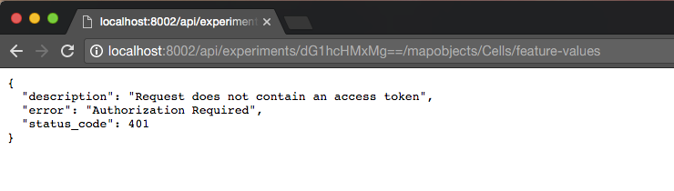

**********
User guide
**********

`TissueMAPS` uses the `client-server model <https://en.wikipedia.org/wiki/Client%E2%80%93server_model>`_, where clients can make requests to the server via a `REST API <http://rest.elkstein.org/2008/02/what-is-rest.html>`_ using the `Hyperstate Transfer Protocol (HTTP) <https://en.wikipedia.org/wiki/Hypertext_Transfer_Protocol>`_.

Most users will interact with the server via the browser-based interface. However, additional `HTTP` client implementations are provided via the :mod:`tmclient` package, which allows users to interact more programmatically with the server. These use cases are covered in the section `interacting with the server <interacting-with-the-server>`_.

The server handles client requests, but delegates the actual processing to the :mod:`tmlibrary` package. The *TissueMAPS* library provides active programming (*API*) and command line interfaces (*CLI*), which can also be used directly, i.e. in a server-independent way. This is covered in the section `using the library <using-the-library>`_.

.. _interacting-with-the-server:

Interacting with the server
===========================

This section demonstrates different ways of interacting with a *TissueMAPS* server. All of them of course require access to a running server instance. This may either be a production server that you access via the internet or a development server running on your local machine. The following examples are given for ``localhost``, but they similarly apply a server running on a remote host.

.. tip:: Here, we connect to the server using *URL* ``http://localhost:8002``. The actual IP address of ``localhost`` is ``127.0.0.1`` (by convention). It's possible to use the name ``localhost``, because this host is specified in ``/etc/hosts``. So when you are running the *TissueMAPS* server on a remote host in the cloud instead of your local machine, you can use the same trick and assign a hostname to the public IP address of that virtual machine. To this end, add a line to ``/etc/hosts``, e.g. ``130.211.160.207   tmaps``. You will then be able to connect to the server via ``http://tmaps``. This can be convenient, because you don't have to remember the exact IP address (which may also be subject to change in case you don't use a static IP address). Note that you don't need to provide the port for the production server, because it will listen to port 80 by default (unlike the development server, who listens to port 8002).

.. _user-interace:

User interface
--------------

Enter the IP address (and optionally the port number) of the server in your browser. This directs you to the *index* site and you are asked for your login credentials.

.. figure:: ./_static/ui_login.png
   :width: 75%
   :align: center

   Login prompt.

   Enter username and password into the provided forms.

.. _user-interface-user-panel:

User panel
^^^^^^^^^^

After successful authorization, you will see an overview of your existing experiments.

.. figure:: ./_static/ui_experiment_list_empty.png
   :width: 75%
   :align: center

   Experiment overview.

   Empty list because no experiments have been created so far.

.. _user-interface-creating-experiment:

Creating an experiment
++++++++++++++++++++++

To create a new :class:`experiment <tmlib.models.experiment.Experiment>`, click on |create_new_exp_button|.

.. figure:: ./_static/ui_experiment_create.png
   :width: 75%
   :align: center

   Experiment creation.

   Provide information about the image acquisition process of the experiment.

When you click on |create_exp_button|, the experiment gets created and you get directed back to the overview.

.. figure:: ./_static/ui_experiment_list_one.png
   :width: 75%
   :align: center

   Experiment overview.

   The created experiment is listed.

.. note:: By default, experiments can only be viewed and modified by the user who created them, but they can be shared with other users. However, this functionality is currently only available via the API (see :class:`ExperimentShare <tmlib.models.user.ExperimentShare>`).

Next, you can upload images and process them. To this end, click on |modify_button|, which directs you to the workflow manager.

.. _user-interface-workflow-manager:

Workflow manager
^^^^^^^^^^^^^^^^

.. figure:: ./_static/ui_workflow.png
   :width: 75%
   :align: center

   Workflow manager.

   Interface for uploading and processing images. At the top of the page there is a button for *upload* and one for each stage of the :ref:`canonical workflow <canonical-workflow>`.

.. _user-interface-workflow-manager-uploading-images:

Uploading image files
+++++++++++++++++++++

To begin with, add a new :class:`plate <tmlib.models.plate.Plate>`, by clicking on |create_plate_button|.

.. figure:: ./_static/ui_plate_create.png
   :width: 75%
   :align: center

   Plate creation.

   Provide a name and optionally a description for the plate.

.. figure:: ./_static/ui_plate_list_one.png
   :width: 75%
   :align: center

   Plate overview.

   The created plate is now listed. It is not yet ready for processing, because it doesn't contain any acquisitions yet.

Select the created plate, by clicking on the link |plate_link|.

.. figure:: ./_static/ui_acquisition_list_empty.png
   :width: 75%
   :align: center

   Acquisition overview.

   Empty list because no acquisitions have been added so far for the selected plate.

Add a new :class:`acquisition <tmlib.models.acquisition.Acquisition>`, by clicking on |create_acq_button|.

.. figure:: ./_static/ui_acquisition_create.png
   :width: 75%
   :align: center

   Acquisition creation.

   Provide a name and optionally a description for the acquistion.

.. figure:: ./_static/ui_acquisition_list_one.png
   :width: 75%
   :align: center

   Acquisition overview.

   The created acquisition is now listed. It has status "WAITING" because no images have yet been uploaded.

Select the created acquisition, by clicking on the link |acq_link|.

.. figure:: ./_static/ui_acquisition_upload.png
   :width: 75%
   :align: center

   Upload.

   Either drag and drop files or folders into the dedicated area or select them from your local filesystem by clicking on |select_files_button|. Then click on |upload_files_button| to start the upload process.

.. figure:: ./_static/ui_acquisition_upload_process.png
   :width: 75%
   :align: center

   Upload in process.

   You can monitor the upload status of individual files.

.. note:: File upload via the user interface works reliable for serveral thousand images. When uploading tens or hundreds of thousands of images, we recomment uploading files via the command line instead. To this end, you can use the ``tm_upload`` tool provided by the :mod:`tmclient` package.

.. note:: The upload process will be interrupted when the page gets reloaded. However, you can simply add the files afterwards again and restart uploading. The server keeps track which files have already been uploaded and won't upload them again.

.. figure:: ./_static/ui_plate_list_one_ready.png
   :width: 75%
   :align: center

   Plate overview.

   The loading bar in the top right corner indicates that the upload was successful and is "TERMINATED". The plate is now ready for processing.

You can add additional acquisitions and plates to the experiments by repeating the steps described above. Once you have uploaded all files, you can continue to process them.

.. _user-interface-workflow-manager-processing-images:

Processing images
+++++++++++++++++

Once you have uploaded all files, you can proceed to the subsequent processing stages.

.. note:: You are prevented from proceeding until upload is completed. Requesting this information from the server may take a few seconds for large experiments.

.. figure:: ./_static/ui_workflow_stage_one.png
   :width: 75%
   :align: center

   Workflow control panel.

   You can toggle between different stages and steps. The view applies to the currently active combination of stage and step - in this case "image convesion" and "metaextract", respectively.

   The loading bars indicate the progress of workflow, stage and step. They are green by default, but turn red as soon as a single job failed. Above the loading bars, you can see the current processing state (e.g. "SUBMITTED", "RUNNING", or "TERMINATED"). When the currently active stage or step is in state "RUNNING", the cog wheel above the loading bar will also start spinning. The cog will also appear on the stage and step tabs to indicate the state of stages or steps, which are not selected at the moment.

   In the main window you can set "batch" and "submission" arguments to control the partition of the computational task into individual jobs and the allocation of resources for each job, respectively. Upon submission, individual jobs will be listed below the argument section. If required arguments are missing for a stage or step, this will be indicated on the corresponding tab by a minus (visible for the "image analysis" stage). In this case, you cannot submit these stages without providing the missing arguments.

   Since the workflow hasn't been submitted yet, the loading bars are all set to zero and no jobs are listed.

You can click through all stages and steps and set arguments according to your needs. Once you are happy with your settings, you can either |save_button| the settings or |submit_button| the workflow for processing (settings get also automatically saved upon submission).

.. note:: Submission depends on the current view. Only the currently active stage as well as stages to the left will be processed. For example, if you are in stage "image preprocessing" and you click on |submit_button|, only stages "image conversion", "image preprocessing" and "pyramid creation" will be submitted.

.. note:: Arguments ``batch_size`` and ``duration`` depend on each other. The larger the batch, i.e. the more images are processed per compute unit, the longer the job will typically take.

.. note:: Arguements ``cores`` and ``memory`` depend upon the available compute resources, i.e. the number of CPU cores and the amount of RAM available per core. The defauls of 3800MB applies to the default machine type flavor at ScienceCloud at University of Zurich and may need to be adapted for other clouds.

For now, let's submit the workflow from the first stage "image conversion".

.. figure:: ./_static/ui_workflow_stage_one_submitted.png
   :width: 75%
   :align: center

   Workflow submission in progress.

   After submitting the workflow from stage "image conversion", the state of step "metaconfig" switched to "RUNNING" and individual jobs are listed. Some of the jobs are already "TERMINATED", while some are still "RUNNING". Note the cogs on the tabs of the other steps indicating that they have also been submitted for processing.

.. figure:: ./_static/ui_workflow_stage_one_done.png
   :width: 75%
   :align: center

   Workflow submission done.

   All steps of stage "image conversion" have been processed and all jobs have "TERMINATED" sucessfully, noticeable by the fully loaded green bars as well as the green checks on stage/step tabs and individual job items.

.. note:: Once a workflow has been submitted, you can safely close the window or disconnect from the internet, since the jobs are processed remotely on the server in an asynchronous manner.

Once stage "image conversion" is done, you can proceed to any other stage and click on |resume_button|. Alternatively, you could have submitted a further downstream stage in the first place.

For the purpose of this demo, we will proceed to stage "pyramid creation" and resume the workflow.

.. figure:: ./_static/ui_workflow_stage_three.png
   :width: 75%
   :align: center

   Workflow submission resumed.

   After successful termination of stage "image conversion", the workflow has been resumed from stage "pyramid creation", which is currently in state "NEW".

.. note:: Once stage "pyramid creation" is done, you can already view the experiment. However, you won't be able to visualize segmented objects on the map. To this end, you first need to process stage "image analysis".

You can further |resubmit_button| the workflow with modified arguments from any stage afterwards.

The image analysis stage is a bit more complex, therefore we will cover it in a separte section.

.. _workflow-interface-image-analysis-pipeline:

Setting up image analysis pipelines
+++++++++++++++++++++++++++++++++++

.. figure:: ./_static/ui_workflow_stage_four.png
   :width: 75%
   :align: center

   Image analysis stage.

   Notice the "extra arguments" section, which hasn't been present in any of the other previous stages. You are required to select a "pipeline", which should be processed by the "jterator" step. Since no pipeline has been created so far, the drop-down menue is empty.

To begin with, you need to create a pipeline. To this end, click on |create_pipe_button|. Give the pipeline a descriptive name, here we call it ``test-pipe``.
This will direct you to a separte interface for defining the pipeline.

.. figure:: ./_static/ui_jterator.png
   :width: 75%
   :align: center

   Jterator interface.

   On the left side in the "Available Modules" column, you find all modules implemented in the :mod:`jtmodules` package. "Pipeline Settings" describes the input for the pipeline in form of "channels" and lists modules that have been added to the pipeline. The module "Module Settings" section describes input arguments and expected outputs of the currently selected module.

.. figure:: ./_static/ui_jterator_module_one.png
   :width: 75%
   :align: center

   Pipeline and module settings.

   You can drag and drop modules from the list of available modules into the indicated field in the *pipeline* section and then click on added item to set module parameters. The order of modules in the pipeline can be rearranged by dragging them up or down.

   You can further select *channels* in the *input* section to make them available to the pipeline. Additional *channels* can be removed when neeeded. The selected "channels" become available as an *input* for the selected module.

.. tip:: Images for all *channels* selected in the *input* section will be loaded into memory (for the acquisition site corresponding to the given batch). So remove any channel you don't use in your pipeline to gain performance.

.. figure:: ./_static/ui_jterator_module_one_rename.png
   :width: 75%
   :align: center

   Module renaming.

   A module can be renamed by clicking on the textfield in the respective pipeline item. Enter a new name in the provided field and press enter. Note, that the name in the "Module Settings" column remains unchanged. It continues to refer to the module source file.

.. note:: Names of modules in the pipeline must be unique. When adding the same module twice, it will be automatically renamed by appending it with a number. Be aware that names of module outputs must be hashable and therefore also unique. Best practice is to use to use the module as a namespace: ``<module_name>.<output_argument_name>``, e.g. ``smooth.smoothed_image`` for the above example. Since module names must be unique the resulting *output* will consequently have a unique name, too.

Add all modules to the pipeline that you need for your analysis and set parameters.

.. note:: Types of *input* parameters are checked internally. Only inputs matching the type definition of the *input* argument are listed in the drop-down menue.

Here, we will first add all the modules required to segment "Nuclei" and "Cells" in the images.

.. figure:: ./_static/ui_jterator_module_many_segment.png
   :width: 75%
   :align: center

   Example segmentation pipeline.

   This pipeline identifies primary ("Nuclei") and secondary objects ("Cells"): The image corresponding to channel "wavelength-1" is smoothed and subsequently thresholded. The resulting mask is then labeled to define individual primary objects. The primary objects are subsequently expanded using a watershed transform of the smoothed image belonging to channel "wavelength-2", which generates secondary objects.

The pipeline can be saved at any time by clicking on |save_button|. This will save the pipeline settings as well as settings of each module in the pipeline.

When all required parameters are set, the pipeline can be submitted by clicking on |submit_button| (submission will automatically save the pipeline as well).

.. figure:: ./_static/ui_jterator_submit.png
   :width: 75%
   :align: center

   Pipeline submission.

   Up to ten jobs can be maximally submitted for a pipeline.

To see which acquisition sites the jobs map to, click on |list_jobs_button|.

.. figure:: ./_static/ui_jterator_joblist.png
   :width: 75%
   :align: center

   Job list.

   The table shows the name of "plate" and "well" as well as the "x" and "y" coordinate of each :class:`site <tmlib.models.site.Site>` corresponding to a particular job. This is intended to help you select job IDs for testing your pipeline, such that you include images from different wells or positions within a well.

.. note:: In the workflow panel you can set a ``batch_size`` for the "jterator" step. However, when you submit the pipeline for testing in the jterator user interface, ``batch_size`` will be automatically set to 1, such that only one acquisition :class:`site <tmlib.models.site.Site>` will be processed per job.

Once submitted, jobs get cued and processed depending on available computational resources. If you have access to enough compute units, all jobs will be processed in parallel.

.. figure:: ./_static/ui_jterator_results.png
   :width: 75%
   :align: center

   Pipeline results.

   Results of individual jobs are listed in the "Results" column. |figure_button| is active for the currently selected module.

When clicking on |figure_button|, the figure for the respective job is displayed in fullscreen mode.

.. figure:: ./_static/ui_jterator_figure.png
   :width: 75%
   :align: center

   Module figures.

   Figures are interactive. Pixels values are displayed when hovering over images. You can also zoom into plots to have a closer look. Be aware, however, that plots may have a reduced resolution.

.. note:: Plotting needs to be explicitely activated for a module by selecting ``true`` for argument "plot". This is done to speed up processing of the pipeline.

When clicking on |log_button|, the log output for the respective job is displayed. The messages includes the log of the entire pipeline and is the same irrespective of which module is currently active.

.. figure:: ./_static/ui_jterator_log.png
   :width: 75%
   :align: center

   Pipeline log outputs.

   Standard output and error are caputered for each pipeline run. The logging level is set to ``INFO`` by default.

To save segmented objects and be able to assign values of extracted features to them, objects need to be registered using the :mod:`register_objects <jtmodules.register_objects>` modules. From a user perspective, the registration simply assigns a name to a label image.

.. figure:: ./_static/ui_jterator_object_registration.png
   :width: 75%
   :align: center

   Object registration.

   Assign a unique, but short and descriptive name to each type of segmented objects that you want to save. To this end, objects need to be provided in form of a labled image, where each object has a unique ID, as output by the :mod:`label <jtmodules.label>` module, for example.

When we are happy with the segmentation results, we can add addtional modules for feature extraction.

.. warning:: All extracted features will be automatically saved. Since the resulting I/O will increase processing time, its recommended to exclude *measurement* modules from the pipeline for tuning segmentation parameters.

.. tip:: You can inactivate modules by clicking on |eye_open_symbol| without having to remove them from the pipeline. Just be aware that this may affect downstream modules, since the *output* of inactivated modules will of course no longer be produced.

.. tip:: You can quickly move down and up in the pipeline in a `Vim <http://www.vim.org/>`_-like manner using the *j* and *k* keys, respectively.

.. figure:: ./_static/ui_jterator_feature_extraction.png
   :width: 75%
   :align: center

   Feature extraction.

   Select a previously registerd object type for which you would like to take a measurement. Some features, such as ``intensity`` require an additional raster image. Others, such as ``morphology`` measure only object size and shape and are thus independent of the actual pixel intensity values.

.. note:: Feature names follow a convention: ``<class>_<statistic>_<channel>``. In case features are intensity-independent, the name reduces to ``<class>_<statistic>``. For the above example this would result in ``Intensity_mean_wavelength-2`` or ``Morphology_area``.

Once you have set up your pipeline, save your pipeline (!) and return to the workflow panel. Select the created pipeline and submit the "image analysis" stage by clicking on |resume_button|. In contrast to submissions in the *jterator* user interface, this will now submit all jobs and potentially run more than one pipeline per job in a sequential manner, depending on the specified ``batch_size``.

.. figure:: ./_static/ui_workflow_stage_four_submission.png
   :width: 75%
   :align: center

   Image analysis submission.

   Select the created pipline in the drop-down menu. In case the pipeline doesn't show up, you may have to |reload_button| the workflow settings.

.. _user-interface-viewer:

Viewer
^^^^^^

Once you've setup your *experiment*, you can view it by returning to the `user panel`_ and clicking on |view_button|.

.. _user-interface-viewer-map:

The MAP
+++++++

The interactive *MAP* is the centerpiece of *TissueMAPS* (as the name implies).

.. figure:: ./_static/ui_viewer.png
   :width: 75%
   :align: center

   Viewer overview.

   Upon initial access, the first channel is shown in the viewport at the maximally zoomed-out resultion level.
   You can zoom in and out using either the mouse wheel or trackpad or the + and - buttons provided at the top left corner of the viewport.
   The map can also be repositions within the viewport by dragging it with the mouse.

   To the right of the viewport is the map sidebar and to the left the tool sidebar. Sections of the map control sidebar can be resized using the mouse and individual items can be rearranged via drag and drop.
   Below the viewport are sliders to zoom along the *z*-axis or time series for experiment comprised of images acquired at different *z* resolutions or time points, respectively.

The map sidebar has the following sections:

    - ``Channels``: one raster image layer for each channel (created during the "pyramid_creation" workflow stage)
    - ``Objects``: one vector layer for each object type (created during the "image_analysis" workflow stage)
    - ``Selections``: tool for selecting mapobjects on the map
    - ``Saved results``: one vector layer for each saved (previously generated) tool result
    - ``Current result``: single vector layer for the most recent tool result

Individual sections are described in more detail below.

.. figure:: ./_static/ui_viewer_sidebar_channels.png
   :width: 75%
   :align: center

   Map sidebar: Channels.

   Channels are represented on the map in form of raster images. Individual channel layers can be toggled as well as dynamically colorized and rescaled.
   By default, channels are shown in grayscale. When multiple channels are active, colors are additively blended (e.g. red + green = yellow).
   Pixel intensities are mapped to 8-bit for map representation. However, intensities value shown below sliders reflect the original bit range.

.. figure:: ./_static/ui_viewer_sidebar_objects.png
   :width: 75%
   :align: center

   Map sidebar: Objects.

   Objects are represented on the map in form of vector graphics. Individual object layers can be toggled as well as dyncamically colorized. In addition, the opacity of object outlines can be adapted. When multiple objects are active, colors are additively blended.

.. note:: Objects of type "Plates", "Wells" and "Sites" will be auto-generated based on available image metadata. These *static* types are independent of parameters set in the "image_analysis" workflow stage.

.. warning:: Object outlines may not be represented 100% accurately on the map, because the polygon contours might have been simplified server side.

.. figure:: ./_static/ui_viewer_sidebar_selections.png
   :width: 75%
   :align: center

   Map sidebar: Selections.

   Objects can be selected and assigned to different groups. A map marker will be dropped at for selected object. An object can be unselected by clicking on it again using the same selection item. It is further possible to assign an object to more than one selection.
   The respective object layer will automatically be activated for the choosen mapobject type.

.. _user-interface-viewer-tools:

Data analysis tools
+++++++++++++++++++

*TissueMAPS* provides a plugin framework for interactive data analysis tools. Available tools are listed in the tool sidebar to the left of the viewport.

.. figure:: ./_static/ui_viewer_tools_example.png
   :width: 75%
   :align: center

   Tool sidebar.

   Each tool is associated with a separate window, which opens when the corresponding tool icon is clicked in the tool sidebar.

   The window content varies between tools depending on their functionality. Typically, there is a section for selection of object types and features and a button to submit the tool request to the server.
   In case of the supervised classification (SVC) tool, there is also a section for assigning selections to label classes, which can be used for training of the classifier.

Let's say you want to perform a supervised classification using the "SVC" tool based on labels provided in form of map selections (see above).
To perform the classification, select an object type (e.g. ``Cells``) and one or more features from and click on |classify_button|. This will submit a request to the server to perform the computation. Once the classification is done the result will appear in the "Current result" section of the map control sidebar.

.. figure:: ./_static/ui_viewer_sidebar_current_result.png
   :width: 75%
   :align: center

   Map sidebar: Current result.

   Once a tool result is available a layer will appear in the "Current result" section. Similar to object layers, they are represented on the map as vector graphics. In contrast to the object layers, however, the filled objects are shown instead outlines. Result layers can also be toggled and the opacity can be changed to reveal underlying channel layers (or other tool result layers).

.. figure:: ./_static/ui_viewer_sidebar_saved_results.png
   :width: 75%
   :align: center

   Map sidebar: Saved results.

   When additional tool requests become available, the "Current result" moves to "Saved results" and gets replaced with the more recent result. Multiple results can be active simultaneously and their colors are additively blended. Transparency of result layers can be controlled independently. Here, we performed an additional unsupervised classification, using the same features and number of classes as in the supervised case, and can now visually compare the results of both analysis on the map.

.. |create_new_exp_button| image:: ./_static/ui_create_new_exp_button.png
   :height: 15px

.. |create_exp_button| image:: ./_static/ui_create_exp_button.png
   :height: 15px

.. |modify_button| image:: ./_static/ui_modify_button.png
   :height: 15px

.. |view_button| image:: ./_static/ui_view_button.png
   :height: 15px

.. |create_plate_button| image:: ./_static/ui_create_plate_button.png
   :height: 15px

.. |plate_link| image:: ./_static/ui_plate_link.png
   :height: 15px

.. |create_acq_button| image:: ./_static/ui_create_acq_button.png
   :height: 15px

.. |acq_link| image:: ./_static/ui_acq_link.png
   :height: 15px

.. |select_files_button| image:: ./_static/ui_select_files_button.png
   :height: 15px

.. |upload_files_button| image:: ./_static/ui_upload_files_button.png
   :height: 15px

.. |submit_button| image:: ./_static/ui_submit_button.png
   :height: 15px

.. |classify_button| image:: ./_static/ui_classify_button.png
   :height: 15px

.. |resume_button| image:: ./_static/ui_resume_button.png
   :height: 15px

.. |reload_button| image:: ./_static/ui_reload_button.png
   :height: 15px

.. |resubmit_button| image:: ./_static/ui_resubmit_button.png
   :height: 15px

.. |save_button| image:: ./_static/ui_save_button.png
   :height: 15px

.. |create_pipe_button| image:: ./_static/ui_create_pipe_button.png
   :height: 15px

.. |list_jobs_button| image:: ./_static/ui_list_jobs_button.png
   :height: 15px

.. |figure_button| image:: ./_static/ui_figure_button.png
   :height: 15px

.. |log_button| image:: ./_static/ui_log_button.png
   :height: 15px

.. |eye_open_symbol| image:: ./_static/ui_eye_open_symbol.png
   :height: 15px

.. _rest-api:

REST API
--------

Clients send requests to the server via *RESTful API*. In case of the user interface this is handled by the browser, but the same can be achieved in more programmatic, browser-independent way.

.. _rest-api-restful-programming:

RESTful programming
^^^^^^^^^^^^^^^^^^^

A request is composed of a resource specification provided in form of a `Uniform Resource Locator (*URL*) <https://en.wikipedia.org/wiki/Uniform_Resource_Locator>`_ and one of the following verbs: ``GET``, ``PUT``, ``POST`` or ``DELETE``.
The server listens to *routes* that catch request messages, handles them and returns a defined response message to the client. This response includes a `status code <https://en.wikipedia.org/wiki/List_of_HTTP_status_codes>`_ (e.g. ``200`` or ``404``) and the actual content. In addition, requests and responses have `headers <https://en.wikipedia.org/wiki/List_of_HTTP_header_fields>`_ that hold information about their content, such as the `media type <https://en.wikipedia.org/wiki/Media_type>`_ (e.g. ``application/json`` or ``image/png``).

Consider the following example:
Let's say you want to *GET* a list your existing *TissueMAPS* experiments. To this end, you can send the following request to the *TissueMAPS* server:

.. code-block:: http

    GET /api/experiments

The server would handle this response via the :func:`get_experiments() <tmserver.api.experiment.get_experiments>` view function and respond with this message (using the example given in the `user interface`_ section):

.. code-block:: http

    HTTP/1.1 200 OK
    Content-Type: application/json

    {
        "data": [
            {
                "id": "MQ==",
                "name": "test",
                "description": "A very nice experiment that will get me into Nature",
                "user": "demo"
            }
        ]
    }

The response has status code ``200``, meaning there were no errors, and the content of type ``application/json`` with the list of existing experiments. In this case, there is only one experiment named ``test`` that belongs to the ``demo`` user.

The same logic also applies to more complex requests that require additional parameters.

To download an image for channel ``wavelength-1`` you could send a request like this:

.. code-block:: http

    GET /experiments/MQ==/channels/wavelength-1/image-files?plate_name=plate01,cycle_index=0,well_name=D03,x=0,y=0,tpoint=0,zplane=0

The server would respond with a message that contains the requested image as *PNG*-compressed binary data, which can be written to a file client-side using the provided filename:

.. code-block:: http

    HTTP/1.1 200 OK
    Content-Type: image/png
    Content-Disposition: attachment; filename="test_D03_x000_y000_z000_t000_wavelength-1.png"

    ...

Similarly, you can download all feature values extracted for objects of type ``Cells``:

.. code-block:: http

    GET /api/experiments/MQ==/mapobjects/Cells/feature-values

In this case, the server would respond with a message containing the requested feature values as *zip*-compressed binary data, which can be written to a file archive using the provided filename:

.. code-block:: http

    HTTP/1.1 200 OK
    Content-Type: application/octet-stream
    Content-Disposition: attachment; filename="test_Cells_features.zip"

    ...

The archive contains two *CSV* files:

- ``test_Cells_features_data.csv``: the actual *n*x*p* feature matrix, where *n* is the number of objects of type "Cells" and *p* the number of extracted features
- ``test_Cells_features_metadata.csv``: related metadata, such as plate and well name, x/y/z coordinate, time point, etc.

For more information about available resources and verbs, please refer to :mod:`tmserver.api`.

In principle, ``GET`` requests could be sent via the browser. You can try it by entering a *URL* into the browser address bar, e.g.::

    http://localhost:8002/api/experiments/dG1hcHMxMg==/mapobjects/Cells/feature-values

The browser will show you the following response message:

   REST API *GET* request.

   The server responds with an error message with status code ``401`` (not authorized) because no access token was provided along with the request, which is required for `JWT authentication <https://jwt.io/introduction/>`_.

So to make such requests in practice, we need another client interface. A *REST API* wrapper can be easily implemented in Python or Matlab or any other language that provides an *HTTP* interface:

Python example:

.. code-block:: python

    import os
    import requests
    import json
    import cgi
    import cv2
    from StringIO import StringIO
    import pandas as pd

    def authenticate(url, username, password):
        response = requests.post(
            url + '/auth',
            data=json.dumps({'username': username, 'password': password}),
            headers={'content-type': 'application/json'}
        )
        response.raise_for_status()
        data = response.json()
        return data['access_token']

    def http_get(url, api_uri, token, **params):
        response = requests.get(
            url + '/' + api_uri, params=params,
            headers={'Authorization': 'JWT ' + token}
        )
        response.raise_for_status()
        return response

    def get_data(url, api_uri, token, **params):
        response = http_get(url, api_uri, token, params)
        data = response.json()
        return data['data']

    def get_image(url, api_uri, token, **params):
        response = http_get(url, api_uri, token, params)
        data = response.content
        return cv2.imdecode(data)

    def get_feature_values(url, api_uri, token, location, **params):
        response = http_get(url, api_uri, token, params)
        data = StringIO(response.content)
        return pd.from_csv(data)

    if __name__ = '__main__':

        url = 'http://localhost:8002'

        # Login
        token = authenticate(url, 'demo', 'XXX')

        # GET list of existing experiments
        experiments = get_data(url, '/api/experiments', token)

        # GET image for channel "wavelength-1"
        image = get_image(
            url, '/api/experiments/MQ==/channels/wavelength-1/image-files', token,
            plate_name='plate01', cycle_index=0, well_name='D03', x=0, y=0,
            tpoint=0, zplane=0
        )

        # GET feature values for objects of type "Cells"
        data = get_feature_values(
            url, '/api/experiments/MQ==/mapobjects/Cells/feature-values', token,
        )

Matlab example:

.. code-block:: matlab

    function [] = __main__()

        url = 'http://localhost:8002';

        % Login
        token = authenticate(url, 'demo', 'XXX');

        % GET list of existing experiments
        experiments = get_data(url, '/api/experiments', token);

        % GET image for channel "wavelength-1"
        image = get_image(url, '/api/experiments/MQ==/channels/wavelength-1/image-files?plate_name=plate01,cycle_index=0,well_name=D03,x=0,y=0,tpoint=0,zplane=0', token);

        % GET feature values for objects of type "Cells"
        data = get_feature_values(url, '/api/experiments/MQ==/mapobjects/Cells/feature-values', token);

    end

    function token = authenticate(url, username, password)
        data = struct('username', username, 'password', password);
        options = weboptions('MediaType', 'application/json');
        response = webwrite([url, '/auth'], data, options);
        token = response.access_token;
    end

    function response = http_get(url, api_uri, token, varargin):
        options = weboptions('KeyName', 'Authorization', 'KeyValue', ['JWT ', token]);
        response = webread([url, '/', api_uri], options, varargin{:});
    end

    function data = get_data(url, api_uri, token, varargin)
        repsonse = http_get(url, api_uri, token, varargin);
        data = response.data;
    end

    function image = get_image(url, api_uri, token, varargin)
        image = http_get(url, api_uri, token, varargin);
    end

    function data = get_feature_values(url, api_uri, token, location, varagin)
        data = http_get(url, api_uri, token, varargin);
    end

.. _rest-api-tmclient:

TmClient package
^^^^^^^^^^^^^^^^

The :mod:`tmclient` package is a *REST API* wrapper that provides an interface (as exemplified above) for users to interact with the *TissueMAPS* server in a programmatic way.

.. _rest-api-tmclient-api:

Active programming interface
++++++++++++++++++++++++++++

You can use the *tmclient* *API* to *get* data for analysis outside of *TissueMAPS*.

The package provides an :class:`UploadService <tmclient.upload.UploadSerive>` and :class:`DownloadService <tmclient.download.DownloadSerive>` to upload and download data, respectively. The examples below are shown for the Python package, but the same interface is available for Matlab and R.

For example, a :class:`ChannelImageFile <tmlib.models.file.ChannelImageFile>` can be downloaded as follows:

.. code-block:: python

    from tmclient import DownloadService

    service = DownloadService(
        host='localhost', port=8002, experiment_name='test', user_name='demo', password='XXX'
    )

    # Download an illumination corrected image
    image = service.download_channel_image(
        plate_name='plate01', well_name='D03', x=0, y=0,
        cycle_index=0, tpoint=0, zplane=0, correct=True
    )

    # Show image dimensions
    print image.dimensions

    # Show first row of pixels
    print image.array[0, :]

    # Show time point at which the image was acquired
    print image.metadata.tpoint

The ``image`` object has type :class:`ChannelImage <tmlib.image.ChannelImage>`, which contains the actual n-dimensional pixel/voxel ``array`` (`numpy.array <https://docs.scipy.org/doc/numpy/reference/generated/numpy.array.html>`_) as well as the corresponding ``metadata`` (:class:`ChannelImageMetadata <tmlib.metadata.ChannelImageMetadata>`).

Similarly, feature values (:class:`FeatureValue <tmlib.models.feature.FeatureValue>`) for a particular :class:`MapobjectType <tmlib.models.mapobject.MapobjectType>` can be downloaded as follows:

.. code-block:: python

    data = service.download_object_feature_values('Cells')

    # Show names of features
    print data.columns

    # Iterate over objects
    for index, values in data.iterrows():
        # Show value of first feature for each object
        print '{index}: {value}'.format(index=index, value=values[0])

    # Iterate over features
    for name, values in data.iteritems():
        # Show value of first object for each feature
        print '{name}: {value}'.format(name=name, value=values[0])

In this case, ``data`` has type `pandas.DataFrame <http://pandas.pydata.org/pandas-docs/stable/generated/pandas.DataFrame.html>`_.

.. _rest-api-tmclient-cli:

Command line interface
++++++++++++++++++++++

The *tmclient* Python package further provides a command line interface for uploading and downloading files. Internally the command line interface uses the *API* just as we did above.

You can download the image for channel ``wavelength-1`` via the following command::

    tm_download -vv --host localhost --port 8002 --user_name demo -password XXX --experiment_name test channel_image --channel_name wavelength-1 --plate_name plate01 --well_name D03 -x 0 -y 0 --cycle_index 0 --correct

or shorter::

    tm_download -vv -H localhost -P 8002 -u demo -p XXX -e test channel_image -c wavelength-1 -p plate01 -w D03 -x 0 -y 0 -i 0 --correct

Similarly, you can download the feature values for ``Cells`` using this command::

    tm_download -vv -H localhost -P 8002 -u demo -p XXX -e test feature_values --object_type Cells

.. note:: By default, files will be downloaded to your temporary directory, e.g. ``/tmp`` (the exact location depends on your operating system). The program will print the location of the file to the console (when called with ``-vv`` or higher logging verbosity). You can specify an alternative download location using the ``--directory`` or ``-d`` argument.

In the same way, microsopce files can be uploaded from directory ``/data/myacquisition`` on your local machine::

    tm_upload -vv -H localhost -P 8002 -u demo -p XXX -e test -d /data/myacquisition microscope_file -p plate01 -a acquisition01

You can also create the ``test`` :class:`Experiment <tmlib.models.experiment.Experiment>` via the command line::

    tm_register -vv -H localhost -P 8002 -u demo -p XXX -e test experiment -m cellvoyager -f 384

And create ``plate01`` :class:`Plate <tmlib.models.plate.Plate>` for experiment ``test``::

    tm_register -vv -H localhost -P 8002 -u demo -p XXX -e test plate -p plate01

.. tip:: You can store passwords in the ``~/.tm_pass`` file as key-value pairs (username: password) in `YAML <http://yaml.org/>`_ format:

    .. code-block:: yaml

        demo: XXX

    This will allow you to omit the password argument in command line calls. This is also not totally save of course, but at least your password won't show up in the ``history``.

.. _using-the-library:

Using the library
=================

.. _library-command-line-interface:

Command line interface
^^^^^^^^^^^^^^^^^^^^^^

.. _library-active-programming-interface:

Active programming interface
^^^^^^^^^^^^^^^^^^^^^^^^^^^^
